# 📐 AIRA — Kiến trúc Hệ thống & Thiết kế Chi tiết

> **AIRA** (Academic Integrity & Research Assistant) — Nền tảng hỗ trợ nghiên cứu khoa học tích hợp AI  
> Phiên bản: 1.0 | Cập nhật: 28/02/2026

---

## Mục lục

1. [Sơ đồ Kiến trúc Hệ thống (System Architecture)](#1-sơ-đồ-kiến-trúc-hệ-thống)
2. [Mô tả Module chính](#2-mô-tả-module-chính)
3. [Thiết kế Luồng dữ liệu (DFD)](#3-thiết-kế-luồng-dữ-liệu-dfd)
4. [Sơ đồ UML](#4-sơ-đồ-uml)
   - 4.1 [Use-case Diagram](#41-use-case-diagram)
   - 4.2 [Sequence Diagrams](#42-sequence-diagrams)
5. [Thiết kế Cơ sở dữ liệu (ERD)](#5-thiết-kế-cơ-sở-dữ-liệu-erd)

---

## 1. Sơ đồ Kiến trúc Hệ thống

### 1.1 Kiến trúc Tổng quan (System Architecture Overview)

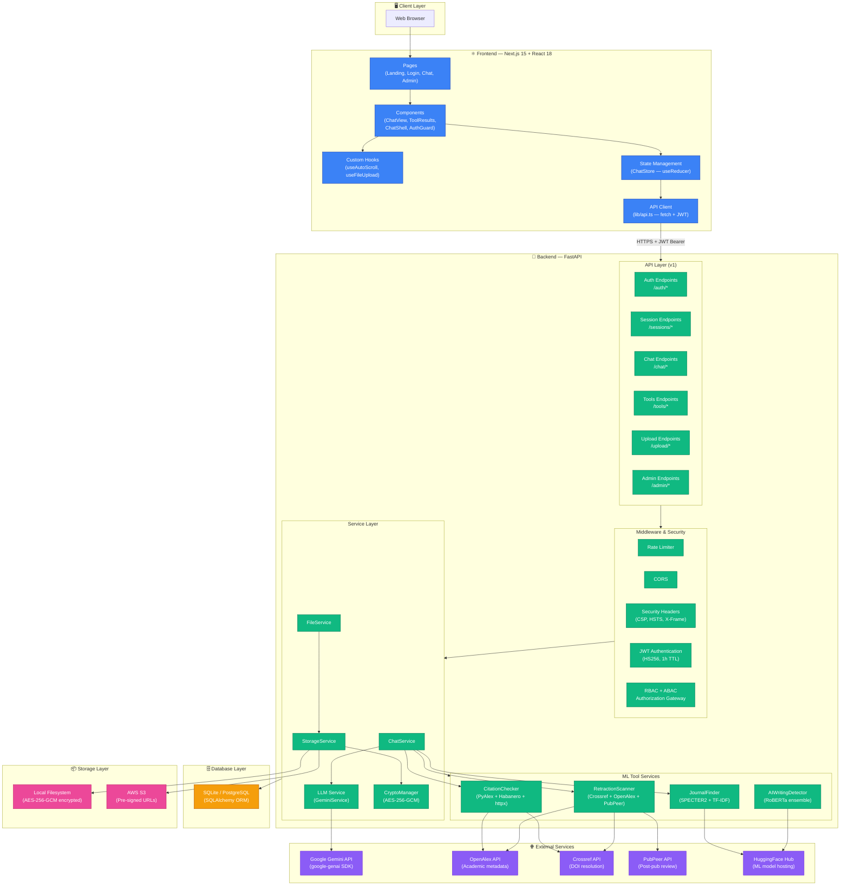

### 1.2 Kiến trúc Phân tầng (Layered Architecture)

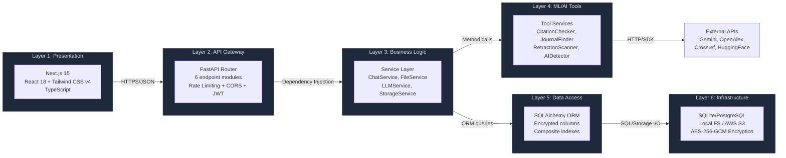

---

## 2. Mô tả Module chính

### 2.1 Frontend Modules

| Module | File(s) | Chức năng |
|--------|---------|-----------|
| **Pages** | `app/page.tsx`, `app/login/page.tsx`, `app/chat/page.tsx`, `app/admin/page.tsx` | 4 trang chính: Landing, Đăng nhập/Đăng ký, Chat AI, Admin Dashboard |
| **ChatView** | `components/chat-view.tsx` | Giao diện chat chính: hiển thị tin nhắn, input area, file attachment, Markdown rendering |
| **ToolResults** | `components/tool-results.tsx` (~515 LOC) | 6 component render kết quả tools: `JournalListCard`, `CitationReportCard`, `RetractionReportCard`, `AIDetectionCard`, `PdfSummaryCard`, `ToolResultRenderer` |
| **ChatShell** | `components/chat-shell.tsx` | Sidebar: danh sách sessions, chuyển theme, thông tin user |
| **AuthGuard** | `components/auth-guard.tsx` | HOC bảo vệ route: redirect nếu chưa đăng nhập hoặc không phải admin |
| **ChatStore** | `lib/chat-store.tsx` | State management dùng `useReducer`: quản lý sessions, messages, loading states |
| **API Client** | `lib/api.ts` | 25 API methods + error handling + JWT token injection |
| **Auth Context** | `lib/auth.tsx` | React Context cho authentication: login, register, logout, token management |
| **Hooks** | `hooks/useAutoScroll.ts`, `hooks/useFileUpload.ts` | Smart scroll (chỉ scroll khi có message mới), Drag-and-drop file upload |

### 2.2 Backend Modules

| Module | File(s) | Chức năng |
|--------|---------|-----------|
| **Auth Endpoints** | `api/v1/endpoints/auth.py` | `POST /register`, `POST /login`, `GET /me`, `POST /promote` — Đăng ký, đăng nhập, lấy user info, promote role |
| **Session Endpoints** | `api/v1/endpoints/sessions.py` | `POST/GET/PATCH/DELETE /sessions` — CRUD sessions với pagination |
| **Chat Endpoints** | `api/v1/endpoints/chat.py` | `POST /chat/completions`, `POST /chat/{session_id}` — Gửi message, nhận AI response |
| **Tools Endpoints** | `api/v1/endpoints/tools.py` | 6 tool APIs: verify-citation, journal-match, retraction-scan, summarize-pdf, detect-ai-writing, ai-detect |
| **Upload Endpoints** | `api/v1/endpoints/upload.py` | `POST /upload`, `GET /upload/{file_id}`, `GET /upload/list_files` — Upload, download, list files |
| **Admin Endpoints** | `api/v1/endpoints/admin.py` | `GET /admin/overview`, `GET /admin/users`, `GET /admin/files` — Dashboard stats, quản lý users & files |

### 2.3 Service Layer

| Service | File | Chức năng |
|---------|------|-----------|
| **ChatService** | `services/chat_service.py` | Orchestration: tạo session, lưu message, gọi LLM/tools theo mode, auto-detect title |
| **LLMService** (GeminiService) | `services/llm_service.py` | Wrapper Google Gemini: `generate_response()`, `summarize_text()` — dùng `google-genai` SDK |
| **FileService** | `services/file_service.py` | Upload workflow: validate → encrypt → store → extract text (PDF via PyMuPDF) |
| **StorageService** | `services/storage_service.py` | Dual-backend abstraction: Local FS hoặc AWS S3, AES-256-GCM encryption, pre-signed URLs |
| **CryptoManager** | `core/crypto.py` | Master key management, AES-256-GCM encrypt/decrypt cho files và DB columns |
| **Bootstrap** | `services/bootstrap.py` | Tạo admin account mặc định khi startup (skip nếu non-dev + insecure password) |

### 2.4 ML Tool Services

| Tool | File | ML Model / API | Chức năng |
|------|------|----------------|-----------|
| **CitationChecker** | `tools/citation_checker.py` | PyAlex + Habanero + httpx | Verify citations: extract DOI → query OpenAlex/Crossref → fuzzy match → confidence score |
| **JournalFinder** | `tools/journal_finder.py` | SPECTER2 (768-dim) / SciBERT / TF-IDF | Recommend journals: encode abstract → cosine similarity với 35+ journal embeddings |
| **RetractionScanner** | `tools/retraction_scan.py` | Crossref + OpenAlex + PubPeer | Scan DOIs: check retraction status, risk level, title-based detection, PubPeer comments |
| **AIWritingDetector** | `tools/ai_writing_detector.py` | RoBERTa (`roberta-base-openai-detector`) | Detect AI text: ensemble 70% ML (RoBERTa) + 30% rule-based (7 features) |

### 2.5 Security & Middleware

| Component | File | Chức năng |
|-----------|------|-----------|
| **JWT Auth** | `core/security.py` | HS256 tokens: `iat`, `jti`, `exp` claims, 1h TTL, bcrypt password hashing |
| **RBAC + ABAC** | `core/authorization.py` | Role-based (ADMIN/RESEARCHER) + Attribute-based (ownership check) access control |
| **Rate Limiter** | `core/rate_limit.py` | IP-based rate limiting, X-Forwarded-For protection, periodic memory cleanup |
| **Security Headers** | `core/middleware.py` | CSP, HSTS, X-Frame-Options, X-Content-Type-Options |
| **Encrypted Types** | `core/encrypted_types.py` | SQLAlchemy custom types: `EncryptedText`, `EncryptedJSON` — transparent AES-256-GCM |
| **Audit Logger** | `core/audit.py` | Structured audit events: login, register, admin actions, file operations |

---

## 3. Thiết kế Luồng dữ liệu (DFD)

### 3.1 DFD Level 0 — Context Diagram

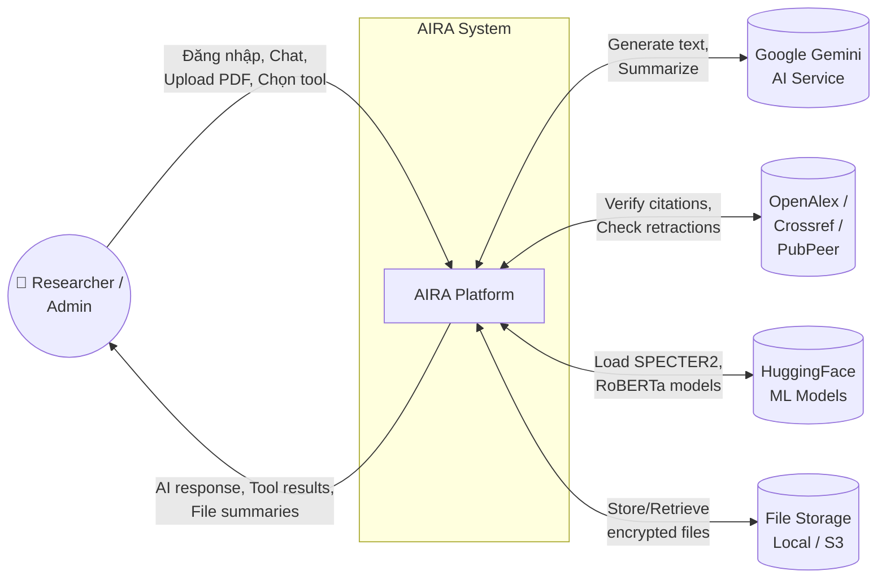

### 3.2 DFD Level 1 — Main Processes

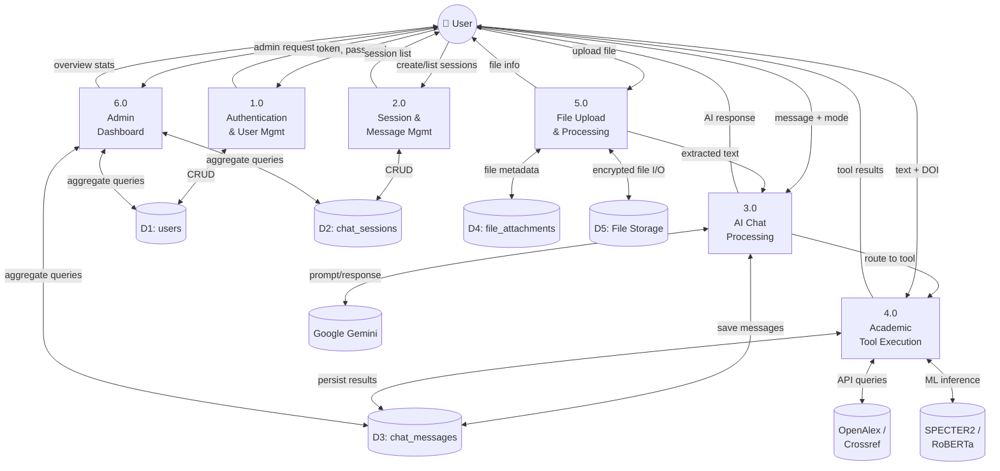

### 3.3 DFD Level 2 — Chi tiết Process 4.0 (Academic Tool Execution)

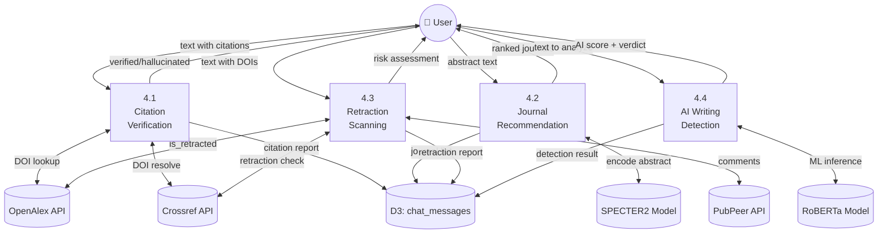

---

## 4. Sơ đồ UML

### 4.1 Use-case Diagram

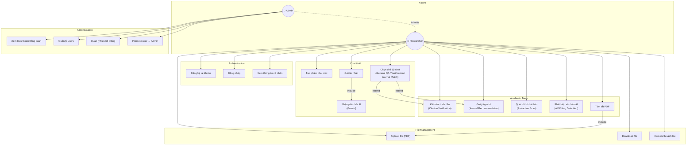

### 4.2 Sequence Diagrams

#### 4.2.1 Sequence Diagram — Đăng nhập & Xác thực

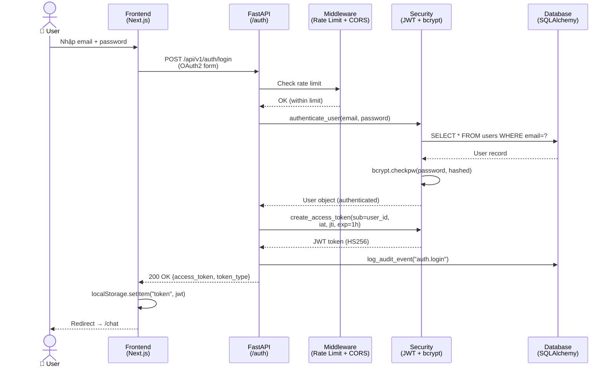

#### 4.2.2 Sequence Diagram — Chat AI (General QA Mode)

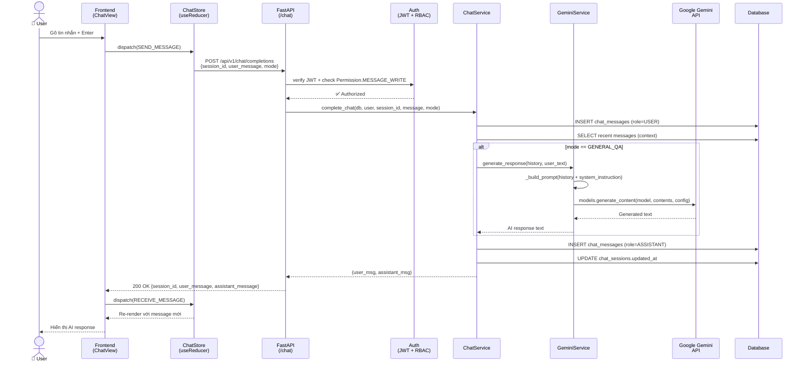

#### 4.2.3 Sequence Diagram — Citation Verification Tool

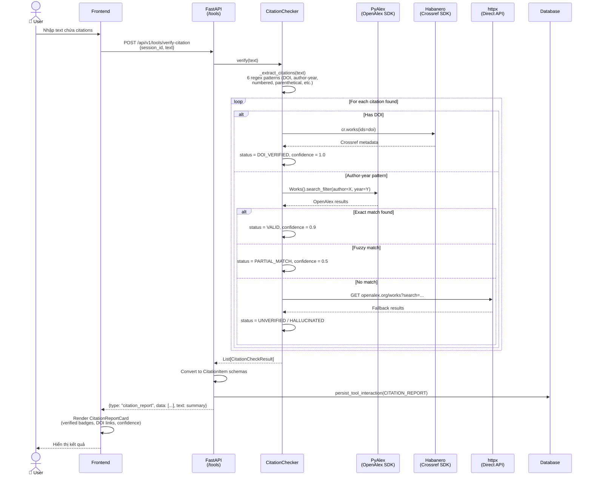

#### 4.2.4 Sequence Diagram — Journal Recommendation Tool

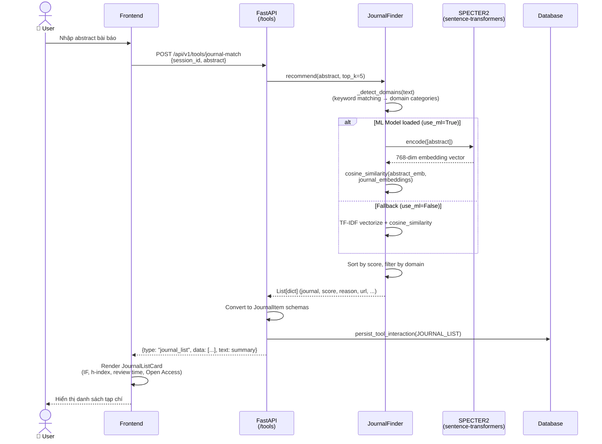

#### 4.2.5 Sequence Diagram — File Upload & PDF Summary

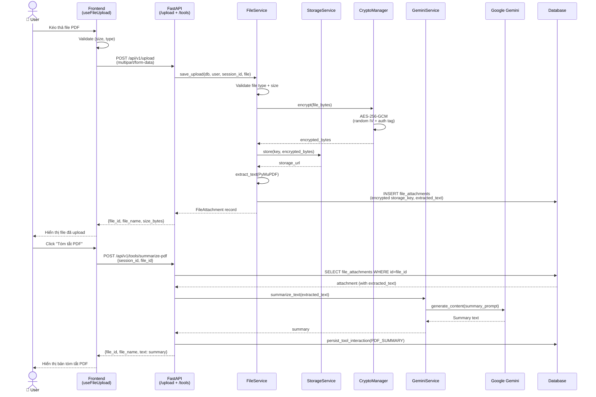

#### 4.2.6 Sequence Diagram — Retraction Scan

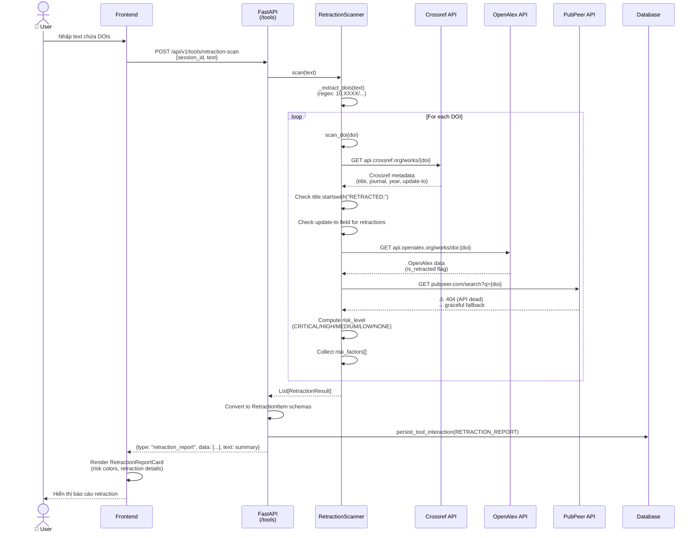

---

## 5. Thiết kế Cơ sở dữ liệu (ERD)

### 5.1 Lược đồ Quan hệ Thực thể (Entity Relationship Diagram)

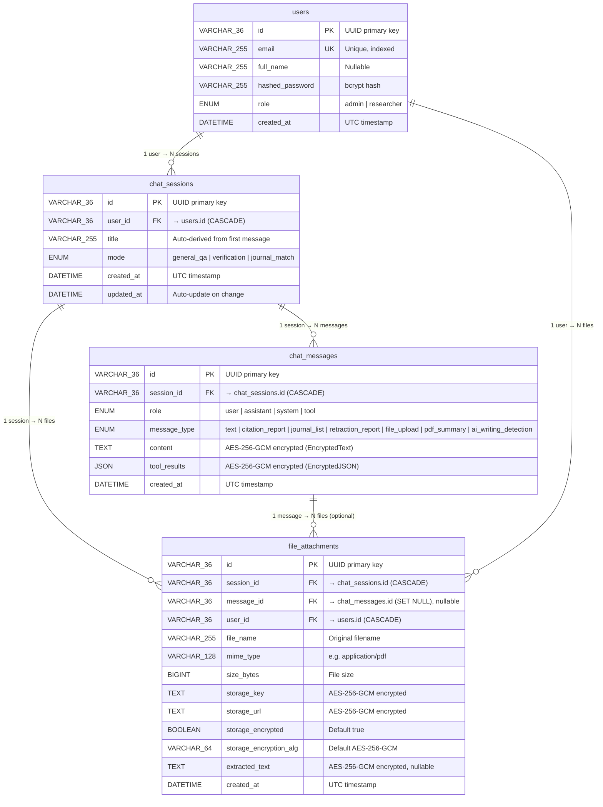

### 5.2 Chi tiết Bảng & Ràng buộc

#### Bảng `users`

| Column | Type | Constraints | Mô tả |
|--------|------|-------------|-------|
| `id` | VARCHAR(36) | PK, DEFAULT uuid4() | UUID định danh |
| `email` | VARCHAR(255) | UNIQUE, NOT NULL, INDEX | Email đăng nhập |
| `full_name` | VARCHAR(255) | NULLABLE | Tên đầy đủ |
| `hashed_password` | VARCHAR(255) | NOT NULL | bcrypt hash ($2b$12$...) |
| `role` | ENUM('admin','researcher') | NOT NULL, DEFAULT 'researcher' | Vai trò trong hệ thống |
| `created_at` | DATETIME(tz) | NOT NULL, DEFAULT now(UTC) | Thời gian tạo |

#### Bảng `chat_sessions`

| Column | Type | Constraints | Mô tả |
|--------|------|-------------|-------|
| `id` | VARCHAR(36) | PK, DEFAULT uuid4() | UUID phiên chat |
| `user_id` | VARCHAR(36) | FK → users.id, ON DELETE CASCADE, INDEX | Chủ sở hữu |
| `title` | VARCHAR(255) | DEFAULT 'New Chat' | Tiêu đề (auto-derived) |
| `mode` | ENUM('general_qa','verification','journal_match') | NOT NULL, DEFAULT 'general_qa' | Chế độ hoạt động |
| `created_at` | DATETIME(tz) | NOT NULL | Thời gian tạo |
| `updated_at` | DATETIME(tz) | NOT NULL, ON UPDATE now(UTC) | Thời gian cập nhật |

#### Bảng `chat_messages`

| Column | Type | Constraints | Mô tả |
|--------|------|-------------|-------|
| `id` | VARCHAR(36) | PK, DEFAULT uuid4() | UUID tin nhắn |
| `session_id` | VARCHAR(36) | FK → chat_sessions.id, ON DELETE CASCADE, INDEX | Phiên chat chứa message |
| `role` | ENUM('user','assistant','system','tool') | NOT NULL | Vai trò gửi message |
| `message_type` | ENUM(7 types) | NOT NULL, DEFAULT 'text' | Loại nội dung |
| `content` | TEXT (EncryptedText) | NULLABLE | Nội dung — mã hóa AES-256-GCM |
| `tool_results` | JSON (EncryptedJSON) | NULLABLE | Kết quả tool — mã hóa AES-256-GCM |
| `created_at` | DATETIME(tz) | NOT NULL | Thời gian tạo |

**Composite Index**: `ix_chatmsg_session_created(session_id, created_at)` — tối ưu query lấy messages theo session, sắp xếp theo thời gian.

#### Bảng `file_attachments`

| Column | Type | Constraints | Mô tả |
|--------|------|-------------|-------|
| `id` | VARCHAR(36) | PK, DEFAULT uuid4() | UUID file |
| `session_id` | VARCHAR(36) | FK → chat_sessions.id, ON DELETE CASCADE, INDEX | Phiên chat chứa file |
| `message_id` | VARCHAR(36) | FK → chat_messages.id, ON DELETE SET NULL, INDEX, NULLABLE | Message liên kết (optional) |
| `user_id` | VARCHAR(36) | FK → users.id, ON DELETE CASCADE, INDEX | Người upload |
| `file_name` | VARCHAR(255) | NOT NULL | Tên file gốc |
| `mime_type` | VARCHAR(128) | NOT NULL | MIME type (application/pdf, ...) |
| `size_bytes` | BIGINT | NOT NULL | Kích thước file (bytes) |
| `storage_key` | TEXT (EncryptedText) | NOT NULL | Đường dẫn lưu trữ — mã hóa |
| `storage_url` | TEXT (EncryptedText) | NOT NULL | URL truy cập — mã hóa |
| `storage_encrypted` | BOOLEAN | DEFAULT TRUE | File có mã hóa at-rest |
| `storage_encryption_alg` | VARCHAR(64) | DEFAULT 'AES-256-GCM' | Thuật toán mã hóa |
| `extracted_text` | TEXT (EncryptedText) | NULLABLE | Text trích xuất từ PDF — mã hóa |
| `created_at` | DATETIME(tz) | NOT NULL | Thời gian upload |

**Composite Indexes**:
- `ix_fileatt_session_created(session_id, created_at)` — truy vấn files theo session
- `ix_fileatt_user_created(user_id, created_at)` — truy vấn files theo user

### 5.3 Mối quan hệ (Relationships)

| Quan hệ | Loại | ON DELETE | Mô tả |
|----------|------|-----------|-------|
| `users` → `chat_sessions` | 1:N | CASCADE | Xóa user → xóa tất cả sessions |
| `chat_sessions` → `chat_messages` | 1:N | CASCADE | Xóa session → xóa tất cả messages |
| `chat_sessions` → `file_attachments` | 1:N | CASCADE | Xóa session → xóa metadata files |
| `chat_messages` → `file_attachments` | 1:N | SET NULL | Xóa message → giữ file, set message_id = NULL |
| `users` → `file_attachments` | 1:N | CASCADE | Xóa user → xóa tất cả files |

### 5.4 Encryption Schema

Các cột được đánh dấu `EncryptedText` / `EncryptedJSON` sử dụng SQLAlchemy custom types trong `core/encrypted_types.py`:

```
Plaintext → AES-256-GCM encrypt(master_key, random_iv) → Base64 encode → Store in DB
DB read → Base64 decode → AES-256-GCM decrypt(master_key, iv, tag) → Plaintext
```

| Bảng | Cột được mã hóa | Type |
|------|-----------------|------|
| `chat_messages` | `content` | EncryptedText |
| `chat_messages` | `tool_results` | EncryptedJSON |
| `file_attachments` | `storage_key` | EncryptedText |
| `file_attachments` | `storage_url` | EncryptedText |
| `file_attachments` | `extracted_text` | EncryptedText |

### 5.5 Sample Data (JSON Demo)

#### User record
```json
{
  "id": "a1b2c3d4-e5f6-7890-abcd-ef1234567890",
  "email": "researcher@university.edu",
  "full_name": "Nguyễn Văn A",
  "hashed_password": "$2b$12$LJ4kAePz6qG2...",
  "role": "researcher",
  "created_at": "2026-02-28T10:00:00+00:00"
}
```

#### Chat Session record
```json
{
  "id": "s1234567-abcd-ef01-2345-678901234567",
  "user_id": "a1b2c3d4-e5f6-7890-abcd-ef1234567890",
  "title": "Deep learning NLP research",
  "mode": "general_qa",
  "created_at": "2026-02-28T10:05:00+00:00",
  "updated_at": "2026-02-28T10:30:00+00:00"
}
```

#### Chat Message record (tool result)
```json
{
  "id": "m9876543-dcba-0fed-5432-109876543210",
  "session_id": "s1234567-abcd-ef01-2345-678901234567",
  "role": "assistant",
  "message_type": "citation_report",
  "content": "ENC:AES256GCM:base64(iv+ciphertext+tag)...",
  "tool_results": "ENC:AES256GCM:base64({\"type\":\"citation_report\",\"data\":[{\"citation\":\"10.1038/nature12373\",\"status\":\"DOI_VERIFIED\",\"confidence\":1.0,\"doi\":\"10.1038/nature12373\",\"title\":\"Nanometre-scale thermometry in a living cell\",\"authors\":[\"Kucsko G.\",\"Maurer P. C.\"],\"year\":2013,\"source\":\"crossref\"}]})...",
  "created_at": "2026-02-28T10:10:00+00:00"
}
```

#### File Attachment record
```json
{
  "id": "f5678901-2345-6789-0abc-def012345678",
  "session_id": "s1234567-abcd-ef01-2345-678901234567",
  "message_id": null,
  "user_id": "a1b2c3d4-e5f6-7890-abcd-ef1234567890",
  "file_name": "research_paper.pdf",
  "mime_type": "application/pdf",
  "size_bytes": 2458624,
  "storage_key": "ENC:AES256GCM:base64(...)...",
  "storage_url": "ENC:AES256GCM:base64(...)...",
  "storage_encrypted": true,
  "storage_encryption_alg": "AES-256-GCM",
  "extracted_text": "ENC:AES256GCM:base64(Introduction: This paper presents...)...",
  "created_at": "2026-02-28T10:08:00+00:00"
}
```

---

## Phụ lục: Tổng hợp API Endpoints

| Method | Endpoint | Auth | Chức năng |
|--------|----------|------|-----------|
| POST | `/api/v1/auth/register` | ❌ | Đăng ký tài khoản mới |
| POST | `/api/v1/auth/login` | ❌ | Đăng nhập (OAuth2 form) |
| GET | `/api/v1/auth/me` | ✅ JWT | Lấy thông tin user hiện tại |
| POST | `/api/v1/auth/promote` | ✅ Admin | Promote user → admin |
| POST | `/api/v1/sessions` | ✅ JWT | Tạo phiên chat mới |
| GET | `/api/v1/sessions` | ✅ JWT | Liệt kê sessions (pagination) |
| GET | `/api/v1/sessions/{id}` | ✅ JWT | Chi tiết 1 session |
| PATCH | `/api/v1/sessions/{id}` | ✅ JWT | Cập nhật title/mode |
| DELETE | `/api/v1/sessions/{id}` | ✅ JWT | Xóa session |
| POST | `/api/v1/chat/completions` | ✅ JWT | Gửi message → nhận AI response |
| POST | `/api/v1/chat/{session_id}` | ✅ JWT | Chat theo session cụ thể |
| GET | `/api/v1/chat/{session_id}/messages` | ✅ JWT | Lấy lịch sử messages |
| POST | `/api/v1/tools/verify-citation` | ✅ JWT | Kiểm tra trích dẫn |
| POST | `/api/v1/tools/journal-match` | ✅ JWT | Gợi ý tạp chí |
| POST | `/api/v1/tools/retraction-scan` | ✅ JWT | Quét retraction |
| POST | `/api/v1/tools/summarize-pdf` | ✅ JWT | Tóm tắt PDF |
| POST | `/api/v1/tools/detect-ai-writing` | ✅ JWT | Phát hiện văn bản AI |
| POST | `/api/v1/tools/ai-detect` | ✅ JWT | Alias detect-ai-writing |
| POST | `/api/v1/upload` | ✅ JWT | Upload file |
| GET | `/api/v1/upload/{file_id}` | ✅ JWT | Download file |
| GET | `/api/v1/upload/list_files` | ✅ JWT | Liệt kê files (pagination) |
| GET | `/api/v1/admin/overview` | ✅ Admin | Dashboard tổng quan |
| GET | `/api/v1/admin/users` | ✅ Admin | Liệt kê users |
| GET | `/api/v1/admin/files` | ✅ Admin | Liệt kê files hệ thống |
