# 📐 AIRA — Kiến trúc Hệ thống & Thiết kế Chi tiết

> **AIRA** (Academic Integrity & Research Assistant) — Nền tảng hỗ trợ nghiên cứu khoa học tích hợp AI  
> Phiên bản: 1.0 | Cập nhật: 28/02/2026

---

## Mục lục

1. [Sơ đồ Kiến trúc Hệ thống (System Architecture)](#1-sơ-đồ-kiến-trúc-hệ-thống)
2. [Mô tả Module chính](#2-mô-tả-module-chính)
3. [Thiết kế Luồng dữ liệu (DFD)](#3-thiết-kế-luồng-dữ-liệu-dfd)
4. [Sơ đồ Component — Luồng Upload & Xử lý file PDF](#4-sơ-đồ-component--luồng-upload--xử-lý-file-pdf)
5. [Sơ đồ UML](#5-sơ-đồ-uml)
   - 5.1 [Use-case Diagram](#51-use-case-diagram)
   - 5.2 [Sequence Diagrams](#52-sequence-diagrams)
6. [Thiết kế Cơ sở dữ liệu (ERD)](#6-thiết-kế-cơ-sở-dữ-liệu-erd)

---

## 1. Sơ đồ Kiến trúc Hệ thống

### 1.1 Kiến trúc Tổng quan (System Architecture Overview)

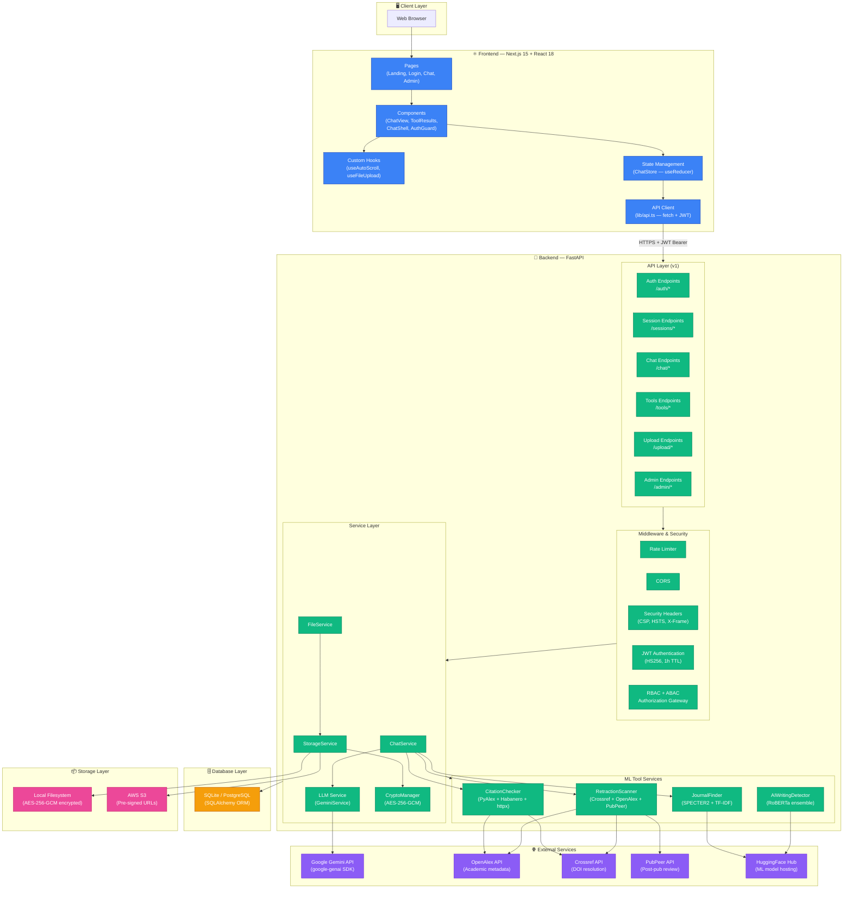
```mermaid
graph TB
    subgraph CLIENT["🖥️ Client Layer"]
        Browser["Web Browser"]
    end

    subgraph FRONTEND["⚛️ Frontend — Next.js 15 + React 18"]
        direction TB
        Pages["Pages<br/>(Landing, Login, Chat, Admin)"]
        Components["Components<br/>(ChatView, ToolResults,<br/>ChatShell, AuthGuard)"]
        Hooks["Custom Hooks<br/>(useAutoScroll, useFileUpload)"]
        Store["State Management<br/>(ChatStore — useReducer)"]
        APIClient["API Client<br/>(lib/api.ts — fetch + JWT)"]
    end

    subgraph BACKEND["🐍 Backend — FastAPI"]
        direction TB

        subgraph API_LAYER["API Layer (v1)"]
            AuthEP["Auth Endpoints<br/>/auth/*"]
            SessionEP["Session Endpoints<br/>/sessions/*"]
            ChatEP["Chat Endpoints<br/>/chat/*"]
            ToolsEP["Tools Endpoints<br/>/tools/*"]
            UploadEP["Upload Endpoints<br/>/upload/*"]
            AdminEP["Admin Endpoints<br/>/admin/*"]
        end

        subgraph MIDDLEWARE["Middleware & Security"]
            RateLimit["Rate Limiter"]
            CORS["CORS"]
            SecurityHeaders["Security Headers<br/>(CSP, HSTS, X-Frame)"]
            JWTAuth["JWT Authentication<br/>(HS256, 1h TTL)"]
            RBAC["RBAC + ABAC<br/>Authorization Gateway"]
        end

        subgraph SERVICE_LAYER["Service Layer"]
            ChatSvc["ChatService"]
            FileSvc["FileService"]
            LLMSvc["LLM Service<br/>(GeminiService)"]
            StorageSvc["StorageService"]
            CryptoMgr["CryptoManager<br/>(AES-256-GCM)"]
        end

        subgraph TOOL_LAYER["ML Tool Services"]
            CitChecker["CitationChecker<br/>(PyAlex + Habanero + httpx)"]
            JournalFinder["JournalFinder<br/>(SPECTER2 + TF-IDF)"]
            RetractScan["RetractionScanner<br/>(Crossref + OpenAlex + PubPeer)"]
            AIDetector["AIWritingDetector<br/>(RoBERTa ensemble)"]
        end
    end

    subgraph DATABASE["🗄️ Database Layer"]
        SQLite["SQLite / PostgreSQL<br/>(SQLAlchemy ORM)"]
    end

    subgraph STORAGE["📦 Storage Layer"]
        LocalFS["Local Filesystem<br/>(AES-256-GCM encrypted)"]
        S3["AWS S3<br/>(Pre-signed URLs)"]
    end

    subgraph EXTERNAL["🌐 External Services"]
        Gemini["Google Gemini API<br/>(google-genai SDK)"]
        OpenAlex["OpenAlex API<br/>(Academic metadata)"]
        Crossref["Crossref API<br/>(DOI resolution)"]
        PubPeer["PubPeer API<br/>(Post-pub review)"]
        HuggingFace["HuggingFace Hub<br/>(ML model hosting)"]
    end

    Browser --> Pages
    Pages --> Components
    Components --> Hooks
    Components --> Store
    Store --> APIClient
    APIClient -->|"HTTPS + JWT Bearer"| API_LAYER

    API_LAYER --> MIDDLEWARE
    MIDDLEWARE --> SERVICE_LAYER
    SERVICE_LAYER --> TOOL_LAYER

    ChatSvc --> LLMSvc
    ChatSvc --> CitChecker
    ChatSvc --> JournalFinder
    ChatSvc --> RetractScan
    FileSvc --> StorageSvc
    StorageSvc --> CryptoMgr

    SERVICE_LAYER --> SQLite
    StorageSvc --> LocalFS
    StorageSvc --> S3

    LLMSvc --> Gemini
    CitChecker --> OpenAlex
    CitChecker --> Crossref
    RetractScan --> Crossref
    RetractScan --> OpenAlex
    RetractScan --> PubPeer
    JournalFinder --> HuggingFace
    AIDetector --> HuggingFace

    classDef frontend fill:#3b82f6,color:#fff,stroke:#1e40af
    classDef backend fill:#10b981,color:#fff,stroke:#047857
    classDef database fill:#f59e0b,color:#fff,stroke:#b45309
    classDef external fill:#8b5cf6,color:#fff,stroke:#6d28d9
    classDef storage fill:#ec4899,color:#fff,stroke:#be185d

    class Pages,Components,Hooks,Store,APIClient frontend
    class AuthEP,SessionEP,ChatEP,ToolsEP,UploadEP,AdminEP,RateLimit,CORS,SecurityHeaders,JWTAuth,RBAC,ChatSvc,FileSvc,LLMSvc,StorageSvc,CryptoMgr,CitChecker,JournalFinder,RetractScan,AIDetector backend
    class SQLite database
    class Gemini,OpenAlex,Crossref,PubPeer,HuggingFace external
    class LocalFS,S3 storage
```

### 1.2 Kiến trúc Phân tầng (Layered Architecture)

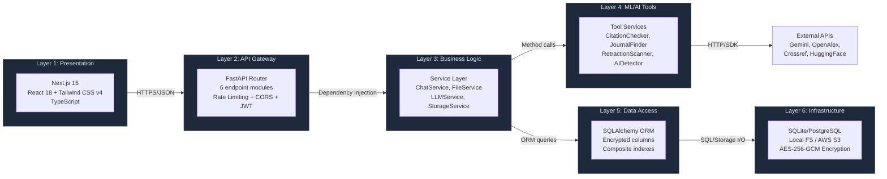
```mermaid
graph LR
    subgraph L1["Layer 1: Presentation"]
        FE["Next.js 15<br/>React 18 + Tailwind CSS v4<br/>TypeScript"]
    end

    subgraph L2["Layer 2: API Gateway"]
        GW["FastAPI Router<br/>6 endpoint modules<br/>Rate Limiting + CORS + JWT"]
    end

    subgraph L3["Layer 3: Business Logic"]
        BL["Service Layer<br/>ChatService, FileService<br/>LLMService, StorageService"]
    end

    subgraph L4["Layer 4: ML/AI Tools"]
        ML["Tool Services<br/>CitationChecker, JournalFinder<br/>RetractionScanner, AIDetector"]
    end

    subgraph L5["Layer 5: Data Access"]
        DA["SQLAlchemy ORM<br/>Encrypted columns<br/>Composite indexes"]
    end

    subgraph L6["Layer 6: Infrastructure"]
        INFRA["SQLite/PostgreSQL<br/>Local FS / AWS S3<br/>AES-256-GCM Encryption"]
    end

    L1 -->|"HTTPS/JSON"| L2
    L2 -->|"Dependency Injection"| L3
    L3 -->|"Method calls"| L4
    L3 -->|"ORM queries"| L5
    L5 -->|"SQL/Storage I/O"| L6
    L4 -->|"HTTP/SDK"| EXT["External APIs<br/>Gemini, OpenAlex,<br/>Crossref, HuggingFace"]

    classDef layer fill:#1e293b,color:#e2e8f0,stroke:#334155
    class L1,L2,L3,L4,L5,L6 layer
```

---

## 2. Mô tả Module chính

### 2.1 Frontend Modules

| Module | File(s) | Chức năng |
|--------|---------|-----------|
| **Pages** | `app/page.tsx`, `app/login/page.tsx`, `app/chat/page.tsx`, `app/admin/page.tsx` | 4 trang chính: Landing, Đăng nhập/Đăng ký, Chat AI, Admin Dashboard |
| **ChatView** | `components/chat-view.tsx` | Giao diện chat chính: hiển thị tin nhắn, input area, file attachment, Markdown rendering |
| **ToolResults** | `components/tool-results.tsx` (~515 LOC) | 6 component render kết quả tools: `JournalListCard`, `CitationReportCard`, `RetractionReportCard`, `AIDetectionCard`, `PdfSummaryCard`, `ToolResultRenderer` |
| **ChatShell** | `components/chat-shell.tsx` | Sidebar: danh sách sessions, chuyển theme, thông tin user |
| **AuthGuard** | `components/auth-guard.tsx` | HOC bảo vệ route: redirect nếu chưa đăng nhập hoặc không phải admin |
| **ChatStore** | `lib/chat-store.tsx` | State management dùng `useReducer`: quản lý sessions, messages, loading states |
| **API Client** | `lib/api.ts` | 25 API methods + error handling + JWT token injection |
| **Auth Context** | `lib/auth.tsx` | React Context cho authentication: login, register, logout, token management |
| **Hooks** | `hooks/useAutoScroll.ts`, `hooks/useFileUpload.ts` | Smart scroll (chỉ scroll khi có message mới), Drag-and-drop file upload |

### 2.2 Backend Modules

| Module | File(s) | Chức năng |
|--------|---------|-----------|
| **Auth Endpoints** | `api/v1/endpoints/auth.py` | `POST /register`, `POST /login`, `GET /me`, `POST /promote` — Đăng ký, đăng nhập, lấy user info, promote role |
| **Session Endpoints** | `api/v1/endpoints/sessions.py` | `POST/GET/PATCH/DELETE /sessions` — CRUD sessions với pagination |
| **Chat Endpoints** | `api/v1/endpoints/chat.py` | `POST /chat/completions`, `POST /chat/{session_id}` — Gửi message, nhận AI response |
| **Tools Endpoints** | `api/v1/endpoints/tools.py` | 6 tool APIs: verify-citation, journal-match, retraction-scan, summarize-pdf, detect-ai-writing, ai-detect |
| **Upload Endpoints** | `api/v1/endpoints/upload.py` | `POST /upload`, `GET /upload/{file_id}`, `GET /upload/list_files` — Upload, download, list files |
| **Admin Endpoints** | `api/v1/endpoints/admin.py` | `GET /admin/overview`, `GET /admin/users`, `GET /admin/files` — Dashboard stats, quản lý users & files |

### 2.3 Service Layer

| Service | File | Chức năng |
|---------|------|-----------|
| **ChatService** | `services/chat_service.py` | Orchestration: tạo session, lưu message, gọi LLM/tools theo mode, auto-detect title |
| **LLMService** (GeminiService) | `services/llm_service.py` | Wrapper Google Gemini với **Function Calling**: `generate_response()` (FC loop + 4 tools), `summarize_text()`, `generate_simple()` — dùng `google-genai` SDK |
| **FileService** | `services/file_service.py` | Upload workflow: validate → encrypt → store → extract text (PDF via PyMuPDF) |
| **StorageService** | `services/storage_service.py` | Dual-backend abstraction: Local FS hoặc AWS S3, AES-256-GCM encryption, pre-signed URLs |
| **CryptoManager** | `core/crypto.py` | Master key management, AES-256-GCM encrypt/decrypt cho files và DB columns |
| **Bootstrap** | `services/bootstrap.py` | Tạo admin account mặc định khi startup (skip nếu non-dev + insecure password) |

### 2.4 ML Tool Services

| Tool | File | ML Model / API | Chức năng |
|------|------|----------------|-----------|
| **CitationChecker** | `tools/citation_checker.py` | PyAlex + Habanero + httpx | Verify citations: extract DOI → query OpenAlex/Crossref → fuzzy match → confidence score |
| **JournalFinder** | `tools/journal_finder.py` | SPECTER2 (768-dim) / SciBERT / TF-IDF | Recommend journals: encode abstract → cosine similarity với 35+ journal embeddings |
| **RetractionScanner** | `tools/retraction_scan.py` | Crossref + OpenAlex + PubPeer | Scan DOIs: check retraction status, risk level, title-based detection, PubPeer comments |
| **AIWritingDetector** | `tools/ai_writing_detector.py` | RoBERTa (`roberta-base-openai-detector`) | Detect AI text: ensemble 70% ML (RoBERTa) + 30% rule-based (7 features) |

### 2.5 Security & Middleware

| Component | File | Chức năng |
|-----------|------|-----------|
| **JWT Auth** | `core/security.py` | HS256 tokens: `iat`, `jti`, `exp` claims, 1h TTL, bcrypt password hashing |
| **RBAC + ABAC** | `core/authorization.py` | Role-based (ADMIN/RESEARCHER) + Attribute-based (ownership check) access control |
| **Rate Limiter** | `core/rate_limit.py` | IP-based rate limiting, X-Forwarded-For protection, periodic memory cleanup |
| **Security Headers** | `core/middleware.py` | CSP, HSTS, X-Frame-Options, X-Content-Type-Options |
| **Encrypted Types** | `core/encrypted_types.py` | SQLAlchemy custom types: `EncryptedText`, `EncryptedJSON` — transparent AES-256-GCM |
| **Audit Logger** | `core/audit.py` | Structured audit events: login, register, admin actions, file operations |

---

## 3. Thiết kế Luồng dữ liệu (DFD)

### 3.1 DFD Level 0 — Context Diagram

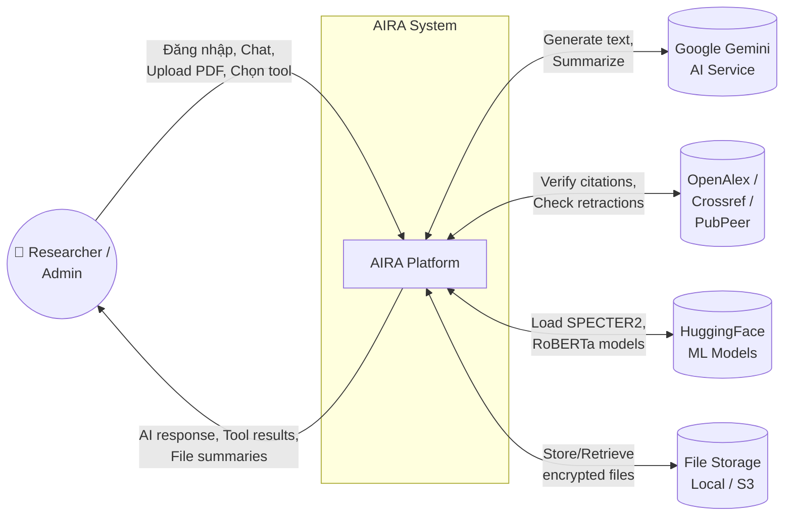
```mermaid
graph LR
    User(("👤 Researcher /<br/>Admin"))

    subgraph AIRA["AIRA System"]
        System["AIRA Platform"]
    end

    Gemini[("Google Gemini<br/>AI Service")]
    AcademicDB[("OpenAlex /<br/>Crossref /<br/>PubPeer")]
    HF[("HuggingFace<br/>ML Models")]
    Storage[("File Storage<br/>Local / S3")]

    User -->|"Đăng nhập, Chat,<br/>Upload PDF, Chọn tool"| System
    System -->|"AI response, Tool results,<br/>File summaries"| User

    System <-->|"Generate text,<br/>Summarize"| Gemini
    System <-->|"Verify citations,<br/>Check retractions"| AcademicDB
    System <-->|"Load SPECTER2,<br/>RoBERTa models"| HF
    System <-->|"Store/Retrieve<br/>encrypted files"| Storage
```

### 3.2 DFD Level 1 — Main Processes

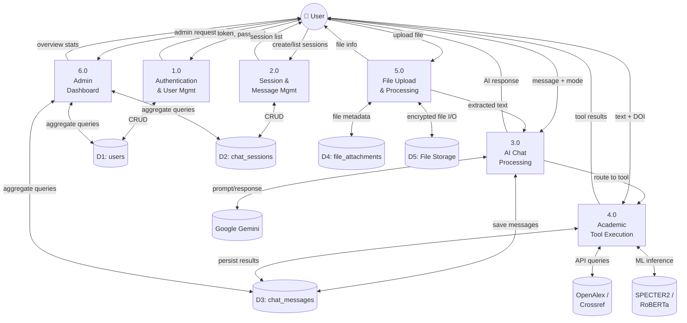
```mermaid
graph TB
    User(("👤 User"))

    P1["1.0<br/>Authentication<br/>& User Mgmt"]
    P2["2.0<br/>Session &<br/>Message Mgmt"]
    P3["3.0<br/>AI Chat<br/>Processing"]
    P4["4.0<br/>Academic<br/>Tool Execution"]
    P5["5.0<br/>File Upload<br/>& Processing"]
    P6["6.0<br/>Admin<br/>Dashboard"]

    DS1[("D1: users")]
    DS2[("D2: chat_sessions")]
    DS3[("D3: chat_messages")]
    DS4[("D4: file_attachments")]
    DS5[("D5: File Storage")]

    Gemini[("Google Gemini")]
    ExtAPIs[("OpenAlex /<br/>Crossref")]
    MLModels[("SPECTER2 /<br/>RoBERTa")]

    User -->|"email, password"| P1
    P1 -->|"JWT token"| User
    P1 <-->|"CRUD"| DS1

    User -->|"create/list sessions"| P2
    P2 <-->|"CRUD"| DS2
    P2 -->|"session list"| User

    User -->|"message + mode"| P3
    P3 <-->|"save messages"| DS3
    P3 -->|"AI response"| User
    P3 <-->|"prompt/response"| Gemini
    P3 -->|"route to tool"| P4

    User -->|"text + DOI"| P4
    P4 <-->|"persist results"| DS3
    P4 -->|"tool results"| User
    P4 <-->|"API queries"| ExtAPIs
    P4 <-->|"ML inference"| MLModels

    User -->|"upload file"| P5
    P5 <-->|"file metadata"| DS4
    P5 <-->|"encrypted file I/O"| DS5
    P5 -->|"file info"| User
    P5 -->|"extracted text"| P3

    User -->|"admin request"| P6
    P6 <-->|"aggregate queries"| DS1
    P6 <-->|"aggregate queries"| DS2
    P6 <-->|"aggregate queries"| DS3
    P6 -->|"overview stats"| User
```

### 3.3 DFD Level 2 — Chi tiết Process 4.0 (Academic Tool Execution)

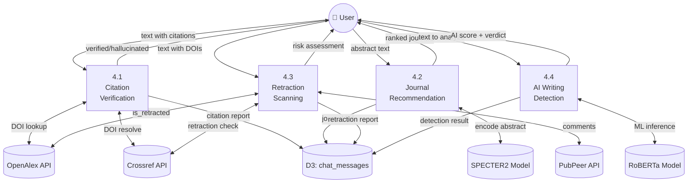
```mermaid
graph TB
    User(("👤 User"))
    DS3[("D3: chat_messages")]

    P4_1["4.1<br/>Citation<br/>Verification"]
    P4_2["4.2<br/>Journal<br/>Recommendation"]
    P4_3["4.3<br/>Retraction<br/>Scanning"]
    P4_4["4.4<br/>AI Writing<br/>Detection"]

    OpenAlex[("OpenAlex API")]
    Crossref[("Crossref API")]
    PubPeer[("PubPeer API")]
    SPECTER2[("SPECTER2 Model")]
    RoBERTa[("RoBERTa Model")]

    User -->|"text with citations"| P4_1
    P4_1 <-->|"DOI lookup"| OpenAlex
    P4_1 <-->|"DOI resolve"| Crossref
    P4_1 -->|"citation report"| DS3
    P4_1 -->|"verified/hallucinated"| User

    User -->|"abstract text"| P4_2
    P4_2 <-->|"encode abstract"| SPECTER2
    P4_2 -->|"journal list"| DS3
    P4_2 -->|"ranked journals"| User

    User -->|"text with DOIs"| P4_3
    P4_3 <-->|"retraction check"| Crossref
    P4_3 <-->|"is_retracted"| OpenAlex
    P4_3 <-->|"comments"| PubPeer
    P4_3 -->|"retraction report"| DS3
    P4_3 -->|"risk assessment"| User

    User -->|"text to analyze"| P4_4
    P4_4 <-->|"ML inference"| RoBERTa
    P4_4 -->|"detection result"| DS3
    P4_4 -->|"AI score + verdict"| User
```

---

## 4. Sơ đồ Component — Luồng Upload & Xử lý file PDF

### 4.1 Component Diagram — Tổng quan luồng Upload PDF


```mermaid
graph TB
    subgraph FRONTEND["⚛️ Frontend (Next.js)"]
        direction TB
        ChatView["ChatView<br/>components/chat-view.tsx"]
        FileHook["useFileUpload Hook<br/>lib/useFileUpload.ts"]
        FileInput["&lt;input type=file&gt;<br/>Drag-and-Drop zone"]
        APIClient["API Client<br/>lib/api.ts"]
        PdfCard["PdfSummaryCard<br/>components/tool-results.tsx"]

        FileInput -->|"onFileChange()"| FileHook
        FileHook -->|"validate (type, size)"| FileHook
        FileHook -->|"api.uploadFile(token, sessionId, file)"| APIClient
        ChatView -->|"openFilePicker()"| FileInput
        ChatView -->|"render kết quả"| PdfCard
    end

    subgraph API_GATEWAY["🔒 API Gateway (FastAPI)"]
        direction TB
        UploadEP["POST /api/v1/upload<br/>endpoints/upload.py"]
        SummarizeEP["POST /api/v1/tools/summarize-pdf<br/>endpoints/tools.py"]
        DownloadEP["GET /api/v1/upload/{file_id}<br/>endpoints/upload.py"]

        subgraph AUTH["Middleware Chain"]
            RateLimit["Rate Limiter"]
            JWT["JWT Verification<br/>(HS256, 1h TTL)"]
            RBAC["RBAC Check<br/>Permission.FILE_UPLOAD /<br/>Permission.TOOL_EXECUTE"]
            SessionACL["Session Access Control<br/>ABAC — ownership check"]
        end

        RateLimit --> JWT --> RBAC --> SessionACL
    end

    subgraph SERVICES["⚙️ Service Layer"]
        direction TB
        FileSvc["FileService<br/>services/file_service.py"]
        ChatSvc["ChatService<br/>services/chat_service.py"]
        LLMSvc["GeminiService<br/>services/llm_service.py"]

        subgraph FILE_OPS["FileService Operations"]
            Validate["validate_mime_type()<br/>sanitize_filename()<br/>_is_pdf_payload()"]
            ExtractText["extract_pdf_text()<br/>→ PyMuPDF (fitz)"]
            SaveUpload["save_upload()"]
            DownloadFile["download_file()"]
        end
    end

    subgraph STORAGE_LAYER["📦 Storage Layer"]
        direction TB
        StorageSvc["StorageService<br/>services/storage_service.py"]

        subgraph STORAGE_OPS["StorageService Operations"]
            GenKey["generate_key()<br/>→ {user_id}/{session_id}/{uuid}-{filename}"]
            Upload["upload(data, key, encrypt=True)"]
            Download["download(key, decrypt=True)"]
            Checksum["calculate_checksum()<br/>→ MD5"]
        end

        subgraph BACKENDS["Storage Backends"]
            LocalFS["LocalStorage<br/>📂 local_storage/<br/>AES-256-GCM encrypted files"]
            S3["S3Storage<br/>☁️ AWS S3 bucket<br/>Pre-signed URLs"]
        end

        StorageSvc --> LocalFS
        StorageSvc --> S3
    end

    subgraph CRYPTO_LAYER["🔐 Encryption Layer"]
        CryptoMgr["CryptoManager<br/>core/crypto.py"]

        subgraph CRYPTO_OPS["AES-256-GCM Operations"]
            EncBytes["encrypt_bytes(plaintext)<br/>→ random IV(12B) + auth tag(16B)"]
            DecBytes["decrypt_bytes(token)<br/>→ verify tag + decrypt"]
            MasterKey["Master Key (32 bytes)<br/>Source: ENV / file / auto-gen"]
        end
    end

    subgraph DATABASE["🗄️ Database"]
        FileTable["file_attachments<br/>(id, session_id, user_id,<br/>file_name, mime_type, size_bytes,<br/>storage_key🔒, storage_url🔒,<br/>extracted_text🔒, created_at)"]
        MsgTable["chat_messages<br/>(message_type=FILE_UPLOAD /<br/>PDF_SUMMARY)"]
    end

    subgraph EXTERNAL["🌐 External"]
        Gemini["Google Gemini API<br/>→ summarize_text()"]
    end

    %% Upload flow connections
    APIClient -->|"POST multipart/form-data"| UploadEP
    UploadEP --> AUTH
    SessionACL --> FileSvc

    FileSvc --> Validate
    Validate -->|"bytes payload"| ExtractText
    FileSvc --> StorageSvc
    StorageSvc --> GenKey
    GenKey --> Upload
    Upload --> CryptoMgr
    CryptoMgr --> EncBytes
    EncBytes -->|"encrypted bytes"| LocalFS

    ExtractText -->|"extracted_text"| FileTable
    SaveUpload -->|"INSERT file_attachments"| FileTable
    FileSvc -->|"log_file_upload()"| ChatSvc
    ChatSvc -->|"INSERT message (FILE_UPLOAD)"| MsgTable

    %% Summarize flow
    APIClient -->|"POST {session_id, file_id}"| SummarizeEP
    SummarizeEP --> AUTH
    SessionACL --> FileSvc
    FileSvc -->|"get_attachment()"| FileTable
    FileTable -->|"extracted_text (decrypted)"| LLMSvc
    LLMSvc -->|"summarize_text()"| Gemini
    Gemini -->|"summary"| LLMSvc
    LLMSvc -->|"summary text"| SummarizeEP
    ChatSvc -->|"persist_tool_interaction<br/>(PDF_SUMMARY)"| MsgTable

    %% Download flow
    APIClient -->|"GET /upload/{file_id}"| DownloadEP
    DownloadEP --> AUTH
    SessionACL --> FileSvc
    FileSvc --> DownloadFile
    DownloadFile --> StorageSvc
    StorageSvc --> Download
    Download --> CryptoMgr
    CryptoMgr --> DecBytes
    DecBytes -->|"decrypted bytes"| DownloadEP

    %% Styles
    classDef frontend fill:#3b82f6,color:#fff,stroke:#1e40af
    classDef api fill:#f59e0b,color:#fff,stroke:#b45309
    classDef service fill:#10b981,color:#fff,stroke:#047857
    classDef storage fill:#ec4899,color:#fff,stroke:#be185d
    classDef crypto fill:#8b5cf6,color:#fff,stroke:#6d28d9
    classDef db fill:#06b6d4,color:#fff,stroke:#0e7490
    classDef external fill:#f97316,color:#fff,stroke:#c2410c

    class ChatView,FileHook,FileInput,APIClient,PdfCard frontend
    class UploadEP,SummarizeEP,DownloadEP,RateLimit,JWT,RBAC,SessionACL api
    class FileSvc,ChatSvc,LLMSvc,Validate,ExtractText,SaveUpload,DownloadFile service
    class StorageSvc,GenKey,Upload,Download,Checksum,LocalFS,S3 storage
    class CryptoMgr,EncBytes,DecBytes,MasterKey crypto
    class FileTable,MsgTable db
    class Gemini external
```

### 4.2 Component Diagram — Chi tiết xử lý nội bộ FileService

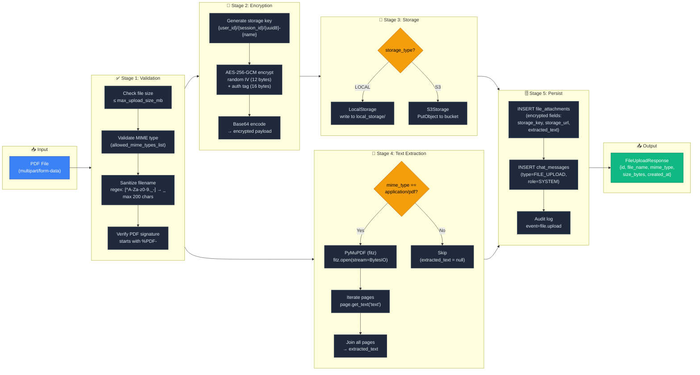
```mermaid
graph LR
    subgraph INPUT["📥 Input"]
        PDF["PDF File<br/>(multipart/form-data)"]
    end

    subgraph VALIDATION["✅ Stage 1: Validation"]
        direction TB
        V1["Check file size<br/>≤ max_upload_size_mb"]
        V2["Validate MIME type<br/>(allowed_mime_types_list)"]
        V3["Sanitize filename<br/>regex: [^A-Za-z0-9._-] → _<br/>max 200 chars"]
        V4["Verify PDF signature<br/>starts with %PDF-"]
        V1 --> V2 --> V3 --> V4
    end

    subgraph ENCRYPTION["🔐 Stage 2: Encryption"]
        direction TB
        E1["Generate storage key<br/>{user_id}/{session_id}/{uuid8}-{name}"]
        E2["AES-256-GCM encrypt<br/>random IV (12 bytes)<br/>+ auth tag (16 bytes)"]
        E3["Base64 encode<br/>→ encrypted payload"]
        E1 --> E2 --> E3
    end

    subgraph STORAGE["💾 Stage 3: Storage"]
        direction TB
        S1{"storage_type?"}
        S2["LocalStorage<br/>write to local_storage/"]
        S3["S3Storage<br/>PutObject to bucket"]
        S1 -->|"LOCAL"| S2
        S1 -->|"S3"| S3
    end

    subgraph EXTRACT["📄 Stage 4: Text Extraction"]
        direction TB
        X1{"mime_type ==<br/>application/pdf?"}
        X2["PyMuPDF (fitz)<br/>fitz.open(stream=BytesIO)"]
        X3["Iterate pages<br/>page.get_text('text')"]
        X4["Join all pages<br/>→ extracted_text"]
        X5["Skip<br/>(extracted_text = null)"]
        X1 -->|"Yes"| X2 --> X3 --> X4
        X1 -->|"No"| X5
    end

    subgraph PERSIST["🗄️ Stage 5: Persist"]
        direction TB
        P1["INSERT file_attachments<br/>(encrypted fields:<br/>storage_key, storage_url,<br/>extracted_text)"]
        P2["INSERT chat_messages<br/>(type=FILE_UPLOAD,<br/>role=SYSTEM)"]
        P3["Audit log<br/>event=file.upload"]
        P1 --> P2 --> P3
    end

    subgraph OUTPUT["📤 Output"]
        Resp["FileUploadResponse<br/>{id, file_name, mime_type,<br/>size_bytes, created_at}"]
    end

    PDF --> VALIDATION
    VALIDATION --> ENCRYPTION
    ENCRYPTION --> STORAGE
    VALIDATION --> EXTRACT
    STORAGE --> PERSIST
    EXTRACT --> PERSIST
    PERSIST --> Resp

    classDef stage fill:#1e293b,color:#e2e8f0,stroke:#334155
    classDef input fill:#3b82f6,color:#fff,stroke:#1e40af
    classDef output fill:#10b981,color:#fff,stroke:#047857
    classDef decision fill:#f59e0b,color:#000,stroke:#b45309

    class V1,V2,V3,V4,E1,E2,E3,S2,S3,X2,X3,X4,X5,P1,P2,P3 stage
    class PDF input
    class Resp output
    class S1,X1 decision
```

### 4.3 Component Diagram — Luồng Tóm tắt PDF (Summarize)

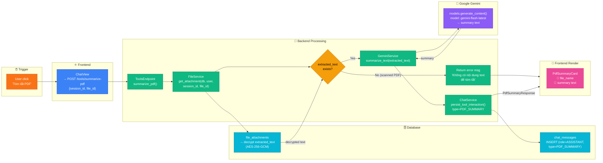
```mermaid
graph LR
    subgraph TRIGGER["🖱️ Trigger"]
        User["User click<br/>'Tóm tắt PDF'"]
    end

    subgraph FRONTEND_FLOW["⚛️ Frontend"]
        FE1["ChatView<br/>→ POST /tools/summarize-pdf<br/>{session_id, file_id}"]
    end

    subgraph BACKEND_FLOW["🐍 Backend Processing"]
        direction TB
        T1["ToolsEndpoint<br/>summarize_pdf()"]
        T2["FileService<br/>get_attachment(db, user,<br/>session_id, file_id)"]
        T3{"extracted_text<br/>exists?"}
        T4["GeminiService<br/>summarize_text(extracted_text)"]
        T5["Return error msg<br/>'Không có nội dung text<br/>để tóm tắt'"]
        T6["ChatService<br/>persist_tool_interaction()<br/>type=PDF_SUMMARY"]

        T1 --> T2 --> T3
        T3 -->|"Yes"| T4
        T3 -->|"No (scanned PDF)"| T5
        T4 --> T6
    end

    subgraph DB_LAYER["🗄️ Database"]
        DB1["file_attachments<br/>→ decrypt extracted_text<br/>(AES-256-GCM)"]
        DB2["chat_messages<br/>INSERT (role=ASSISTANT,<br/>type=PDF_SUMMARY)"]
    end

    subgraph GEMINI["🤖 Google Gemini"]
        GEM["models.generate_content()<br/>model: gemini-flash-latest<br/>→ summary text"]
    end

    subgraph RENDER["🎨 Frontend Render"]
        Card["PdfSummaryCard<br/>📄 file_name<br/>📝 summary text"]
    end

    User --> FE1
    FE1 --> T1
    T2 --> DB1
    DB1 -->|"decrypted text"| T3
    T4 --> GEM
    GEM -->|"summary"| T4
    T6 --> DB2
    T5 --> RENDER
    T6 -->|"PdfSummaryResponse"| RENDER

    classDef trigger fill:#f97316,color:#fff,stroke:#c2410c
    classDef frontend fill:#3b82f6,color:#fff,stroke:#1e40af
    classDef backend fill:#10b981,color:#fff,stroke:#047857
    classDef db fill:#06b6d4,color:#fff,stroke:#0e7490
    classDef gemini fill:#8b5cf6,color:#fff,stroke:#6d28d9
    classDef render fill:#ec4899,color:#fff,stroke:#be185d
    classDef decision fill:#f59e0b,color:#000,stroke:#b45309

    class User trigger
    class FE1 frontend
    class T1,T2,T4,T5,T6 backend
    class DB1,DB2 db
    class GEM gemini
    class Card render
    class T3 decision
```

### 4.4 Component Diagram — Luồng Retraction Scan

#### 4.4.1 Tổng quan luồng Retraction Scan

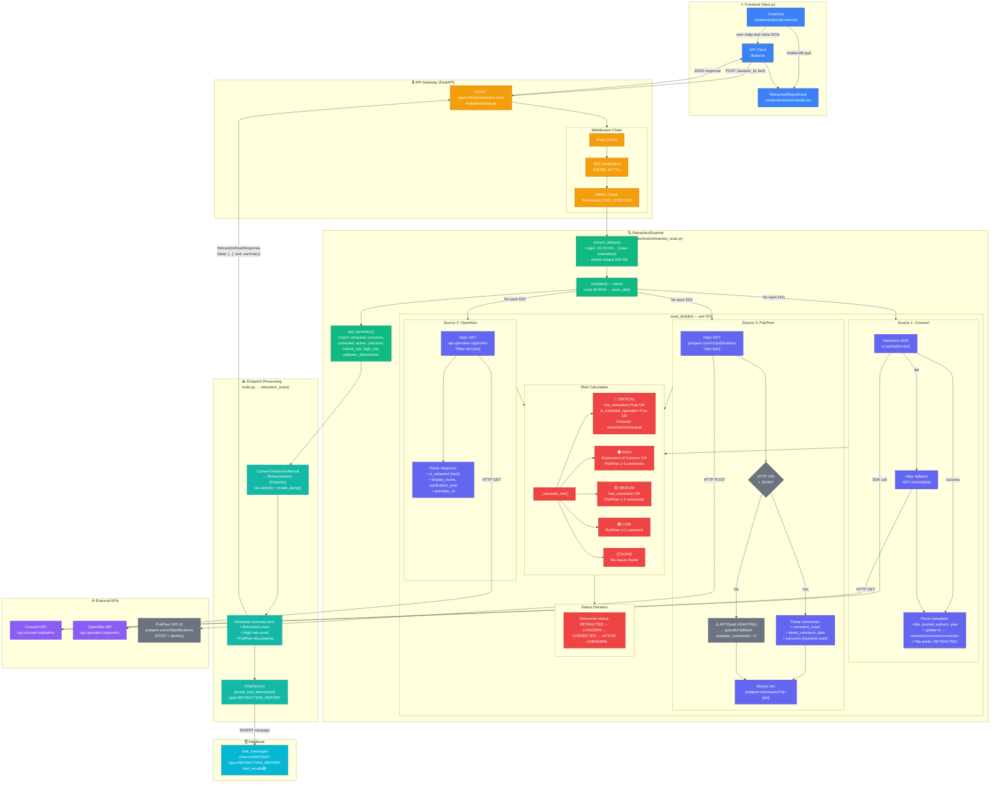
```mermaid
graph TB
    subgraph FRONTEND["⚛️ Frontend (Next.js)"]
        direction TB
        ChatView["ChatView<br/>components/chat-view.tsx"]
        APIClient["API Client<br/>lib/api.ts"]
        RetractCard["RetractionReportCard<br/>components/tool-results.tsx"]

        ChatView -->|"user nhập text chứa DOIs"| APIClient
        ChatView -->|"render kết quả"| RetractCard
    end

    subgraph API_GATEWAY["🔒 API Gateway (FastAPI)"]
        direction TB
        RetractEP["POST /api/v1/tools/retraction-scan<br/>endpoints/tools.py"]

        subgraph AUTH["Middleware Chain"]
            RateLimit["Rate Limiter"]
            JWT["JWT Verification<br/>(HS256, 1h TTL)"]
            RBAC["RBAC Check<br/>Permission.TOOL_EXECUTE"]
        end

        RateLimit --> JWT --> RBAC
    end

    subgraph SCANNER["🔍 RetractionScanner<br/>services/tools/retraction_scan.py"]
        direction TB
        ExtractDOI["extract_doi(text)<br/>regex: 10.XXXX/... (case-insensitive)<br/>→ sorted unique DOI list"]

        subgraph SCAN_DOI["scan_doi(doi) — per DOI"]
            direction TB

            subgraph SRC1["Source 1: Crossref"]
                CR_Hab["Habanero SDK<br/>cr.works(ids=doi)"]
                CR_HTTP["httpx fallback<br/>GET /works/{doi}"]
                CR_Parse["Parse metadata:<br/>• title, journal, authors, year<br/>• update-to → retraction/concern/correction<br/>• Title prefix: RETRACTED:"]
                CR_Hab -->|"fail"| CR_HTTP
                CR_Hab -->|"success"| CR_Parse
                CR_HTTP --> CR_Parse
            end

            subgraph SRC2["Source 2: OpenAlex"]
                OA_Query["httpx GET<br/>api.openalex.org/works<br/>?filter=doi:{doi}"]
                OA_Parse["Parse response:<br/>• is_retracted (bool)<br/>• display_name, publication_year<br/>• openalex_id"]
                OA_Query --> OA_Parse
            end

            subgraph SRC3["Source 3: PubPeer"]
                PP_Query["httpx GET<br/>pubpeer.com/v1/publications<br/>?doi={doi}"]
                PP_Check{"HTTP 200<br/>+ JSON?"}
                PP_Parse["Parse comments:<br/>• comment_count<br/>• latest_comment_date<br/>• concerns (keyword scan)"]
                PP_Dead["⚠️ API Dead (404/HTML)<br/>→ graceful fallback<br/>pubpeer_comments = 0"]
                PP_URL["Always set:<br/>pubpeer.com/search?q={doi}"]
                PP_Query --> PP_Check
                PP_Check -->|"Yes"| PP_Parse
                PP_Check -->|"No"| PP_Dead
                PP_Parse --> PP_URL
                PP_Dead --> PP_URL
            end

            subgraph RISK_CALC["Risk Calculation"]
                CalcRisk["_calculate_risk()"]
                R_CRIT["🔴 CRITICAL<br/>has_retraction=True OR<br/>is_retracted_openalex=True OR<br/>Crossref: retraction/withdrawal"]
                R_HIGH["🟠 HIGH<br/>Expression of Concern OR<br/>PubPeer ≥ 5 comments"]
                R_MED["🟡 MEDIUM<br/>has_correction OR<br/>PubPeer ≥ 2 comments"]
                R_LOW["🟢 LOW<br/>PubPeer ≥ 1 comment"]
                R_NONE["⚪ NONE<br/>No issues found"]
                CalcRisk --> R_CRIT
                CalcRisk --> R_HIGH
                CalcRisk --> R_MED
                CalcRisk --> R_LOW
                CalcRisk --> R_NONE
            end

            subgraph STATUS_DECIDE["Status Decision"]
                StatusLogic["Determine status:<br/>RETRACTED → CONCERN →<br/>CORRECTED → ACTIVE → UNKNOWN"]
            end
        end

        ScanBatch["scan(text) — batch<br/>Loop all DOIs → scan_doi()"]
        Summary["get_summary()<br/>Count: retracted, concerns,<br/>corrected, active, unknown,<br/>critical_risk, high_risk,<br/>pubpeer_discussions"]
    end

    subgraph ENDPOINT_LOGIC["📊 Endpoint Processing<br/>tools.py → retraction_scan()"]
        Convert["Convert RetractionResult<br/>→ RetractionItem (Pydantic)<br/>via asdict() + model_dump()"]
        GenSummary["Generate summary text:<br/>• Retracted count<br/>• High risk count<br/>• PubPeer discussions"]
        Persist["ChatService<br/>persist_tool_interaction()<br/>type=RETRACTION_REPORT"]
    end

    subgraph DATABASE["🗄️ Database"]
        MsgTable["chat_messages<br/>(role=ASSISTANT,<br/>type=RETRACTION_REPORT,<br/>tool_results🔒)"]
    end

    subgraph EXTERNAL["🌐 External APIs"]
        CrossrefAPI["Crossref API<br/>api.crossref.org/works"]
        OpenAlexAPI["OpenAlex API<br/>api.openalex.org/works"]
        PubPeerAPI["PubPeer API v3<br/>pubpeer.com/v3/publications<br/>(POST + devkey)"]
    end

    %% Main flow
    APIClient -->|"POST {session_id, text}"| RetractEP
    RetractEP --> AUTH
    RBAC --> ExtractDOI
    ExtractDOI --> ScanBatch

    ScanBatch -->|"for each DOI"| SRC1
    ScanBatch -->|"for each DOI"| SRC2
    ScanBatch -->|"for each DOI"| SRC3

    CR_Hab -->|"SDK call"| CrossrefAPI
    CR_HTTP -->|"HTTP GET"| CrossrefAPI
    OA_Query -->|"HTTP GET"| OpenAlexAPI
    PP_Query -->|"HTTP POST"| PubPeerAPI

    SRC1 --> RISK_CALC
    SRC2 --> RISK_CALC
    SRC3 --> RISK_CALC
    RISK_CALC --> STATUS_DECIDE

    ScanBatch --> Summary
    Summary --> Convert
    Convert --> GenSummary
    GenSummary --> Persist
    Persist -->|"INSERT message"| MsgTable

    GenSummary -->|"RetractionScanResponse<br/>{data: [...], text: summary}"| RetractEP
    RetractEP -->|"JSON response"| APIClient
    APIClient --> RetractCard

    %% Styles
    classDef frontend fill:#3b82f6,color:#fff,stroke:#1e40af
    classDef api fill:#f59e0b,color:#fff,stroke:#b45309
    classDef scanner fill:#10b981,color:#fff,stroke:#047857
    classDef source fill:#6366f1,color:#fff,stroke:#4338ca
    classDef risk fill:#ef4444,color:#fff,stroke:#b91c1c
    classDef db fill:#06b6d4,color:#fff,stroke:#0e7490
    classDef external fill:#8b5cf6,color:#fff,stroke:#6d28d9
    classDef endpoint fill:#14b8a6,color:#fff,stroke:#0d9488
    classDef dead fill:#6b7280,color:#fff,stroke:#4b5563

    class ChatView,APIClient,RetractCard frontend
    class RetractEP,RateLimit,JWT,RBAC api
    class ExtractDOI,ScanBatch,Summary scanner
    class CR_Hab,CR_HTTP,CR_Parse,OA_Query,OA_Parse,PP_Query,PP_Parse,PP_URL source
    class CalcRisk,R_CRIT,R_HIGH,R_MED,R_LOW,R_NONE,StatusLogic risk
    class MsgTable db
    class CrossrefAPI,OpenAlexAPI external
    class PubPeerAPI,PP_Dead,PP_Check dead
    class Convert,GenSummary,Persist endpoint
```

#### 4.4.2 Chi tiết xử lý nội bộ scan_doi()

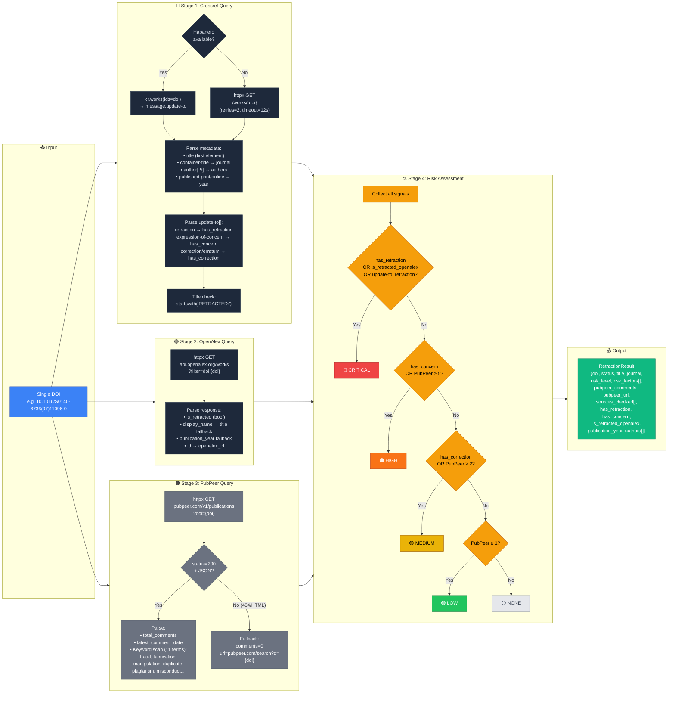
```mermaid
graph LR
    subgraph INPUT["📥 Input"]
        DOI["Single DOI<br/>e.g. 10.1016/S0140-6736(97)11096-0"]
    end

    subgraph CROSSREF["🔵 Stage 1: Crossref Query"]
        direction TB
        C1{"Habanero<br/>available?"}
        C2["cr.works(ids=doi)<br/>→ message.update-to"]
        C3["httpx GET<br/>/works/{doi}<br/>(retries=2, timeout=12s)"]
        C4["Parse metadata:<br/>• title (first element)<br/>• container-title → journal<br/>• author[:5] → authors<br/>• published-print/online → year"]
        C5["Parse update-to[]:<br/>retraction → has_retraction<br/>expression-of-concern → has_concern<br/>correction/erratum → has_correction"]
        C6["Title check:<br/>startswith('RETRACTED:')"]
        C1 -->|"Yes"| C2
        C1 -->|"No"| C3
        C2 --> C4
        C3 --> C4
        C4 --> C5
        C5 --> C6
    end

    subgraph OPENALEX["🟢 Stage 2: OpenAlex Query"]
        direction TB
        O1["httpx GET<br/>api.openalex.org/works<br/>?filter=doi:{doi}"]
        O2["Parse response:<br/>• is_retracted (bool)<br/>• display_name → title fallback<br/>• publication_year fallback<br/>• id → openalex_id"]
        O1 --> O2
    end

    subgraph PUBPEER["🟠 Stage 3: PubPeer Query"]
        direction TB
        P1["httpx GET<br/>pubpeer.com/v1/publications<br/>?doi={doi}"]
        P2{"status=200<br/>+ JSON?"}
        P3["Parse:<br/>• total_comments<br/>• latest_comment_date<br/>• Keyword scan (11 terms):<br/>fraud, fabrication,<br/>manipulation, duplicate,<br/>plagiarism, misconduct..."]
        P4["Fallback:<br/>comments=0<br/>url=pubpeer.com/search?q={doi}"]
        P1 --> P2
        P2 -->|"Yes"| P3
        P2 -->|"No (404/HTML)"| P4
    end

    subgraph RISK["⚖️ Stage 4: Risk Assessment"]
        direction TB
        R1["Collect all signals"]
        R2{"has_retraction<br/>OR is_retracted_openalex<br/>OR update-to: retraction?"}
        R3["🔴 CRITICAL"]
        R4{"has_concern<br/>OR PubPeer ≥ 5?"}
        R5["🟠 HIGH"]
        R6{"has_correction<br/>OR PubPeer ≥ 2?"}
        R7["🟡 MEDIUM"]
        R8{"PubPeer ≥ 1?"}
        R9["🟢 LOW"]
        R10["⚪ NONE"]

        R1 --> R2
        R2 -->|"Yes"| R3
        R2 -->|"No"| R4
        R4 -->|"Yes"| R5
        R4 -->|"No"| R6
        R6 -->|"Yes"| R7
        R6 -->|"No"| R8
        R8 -->|"Yes"| R9
        R8 -->|"No"| R10
    end

    subgraph OUTPUT["📤 Output"]
        Result["RetractionResult<br/>{doi, status, title, journal,<br/>risk_level, risk_factors[],<br/>pubpeer_comments, pubpeer_url,<br/>sources_checked[],<br/>has_retraction, has_concern,<br/>is_retracted_openalex,<br/>publication_year, authors[]}"]
    end

    DOI --> CROSSREF
    DOI --> OPENALEX
    DOI --> PUBPEER
    CROSSREF --> RISK
    OPENALEX --> RISK
    PUBPEER --> RISK
    RISK --> OUTPUT

    classDef input fill:#3b82f6,color:#fff,stroke:#1e40af
    classDef crossref fill:#1e293b,color:#e2e8f0,stroke:#334155
    classDef openalex fill:#1e293b,color:#e2e8f0,stroke:#334155
    classDef pubpeer fill:#6b7280,color:#fff,stroke:#4b5563
    classDef risk fill:#7c3aed,color:#fff,stroke:#5b21b6
    classDef output fill:#10b981,color:#fff,stroke:#047857
    classDef decision fill:#f59e0b,color:#000,stroke:#b45309
    classDef critical fill:#ef4444,color:#fff,stroke:#b91c1c
    classDef high fill:#f97316,color:#fff,stroke:#c2410c
    classDef medium fill:#eab308,color:#000,stroke:#a16207
    classDef low fill:#22c55e,color:#fff,stroke:#15803d
    classDef none fill:#e5e7eb,color:#374151,stroke:#9ca3af

    class DOI input
    class C1,C2,C3,C4,C5,C6 crossref
    class O1,O2 openalex
    class P1,P2,P3,P4 pubpeer
    class R1,R2,R4,R6,R8 decision
    class R3 critical
    class R5 high
    class R7 medium
    class R9 low
    class R10 none
    class Result output
```

---

## 5. Sơ đồ UML

### 5.1 Use-case Diagram

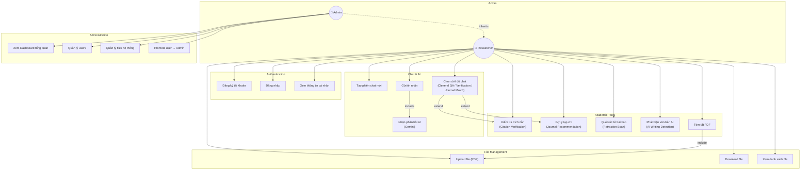
```mermaid
graph TB
    subgraph actors["Actors"]
        Researcher(("👤 Researcher"))
        Admin(("👑 Admin"))
    end

    subgraph uc_auth["Authentication"]
        UC1["Đăng ký tài khoản"]
        UC2["Đăng nhập"]
        UC3["Xem thông tin cá nhân"]
    end

    subgraph uc_chat["Chat & AI"]
        UC4["Tạo phiên chat mới"]
        UC5["Gửi tin nhắn"]
        UC6["Nhận phản hồi AI<br/>(Gemini)"]
        UC7["Chọn chế độ chat<br/>(General QA / Verification /<br/>Journal Match)"]
    end

    subgraph uc_tools["Academic Tools"]
        UC8["Kiểm tra trích dẫn<br/>(Citation Verification)"]
        UC9["Gợi ý tạp chí<br/>(Journal Recommendation)"]
        UC10["Quét rút bỏ bài báo<br/>(Retraction Scan)"]
        UC11["Phát hiện văn bản AI<br/>(AI Writing Detection)"]
        UC12["Tóm tắt PDF"]
    end

    subgraph uc_file["File Management"]
        UC13["Upload file (PDF)"]
        UC14["Download file"]
        UC15["Xem danh sách file"]
    end

    subgraph uc_admin["Administration"]
        UC16["Xem Dashboard tổng quan"]
        UC17["Quản lý users"]
        UC18["Quản lý files hệ thống"]
        UC19["Promote user → Admin"]
    end

    Researcher --> UC1
    Researcher --> UC2
    Researcher --> UC3
    Researcher --> UC4
    Researcher --> UC5
    UC5 -->|"include"| UC6
    Researcher --> UC7
    Researcher --> UC8
    Researcher --> UC9
    Researcher --> UC10
    Researcher --> UC11
    Researcher --> UC12
    Researcher --> UC13
    Researcher --> UC14
    Researcher --> UC15

    Admin --> UC16
    Admin --> UC17
    Admin --> UC18
    Admin --> UC19

    Admin -.->|"inherits"| Researcher

    UC7 -->|"extend"| UC8
    UC7 -->|"extend"| UC9
    UC12 -->|"include"| UC13
```

### 5.2 Sequence Diagrams

#### 5.2.1 Sequence Diagram — Đăng nhập & Xác thực

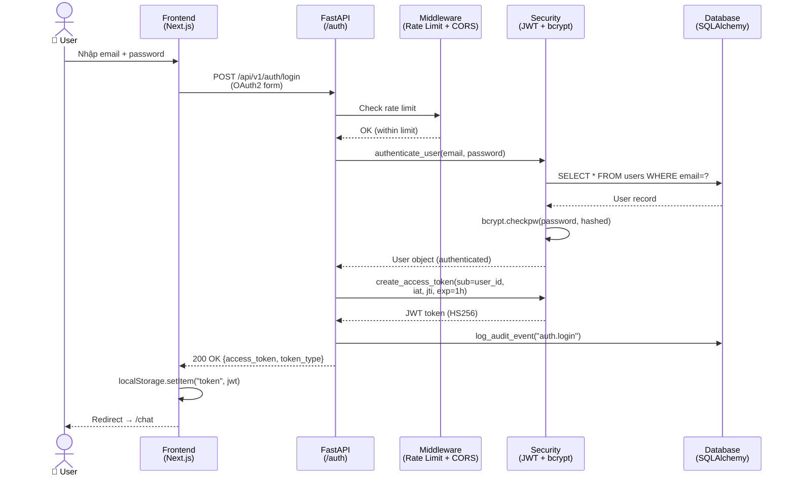
```mermaid
sequenceDiagram
    actor User as 👤 User
    participant FE as Frontend<br/>(Next.js)
    participant API as FastAPI<br/>(/auth)
    participant MW as Middleware<br/>(Rate Limit + CORS)
    participant SEC as Security<br/>(JWT + bcrypt)
    participant DB as Database<br/>(SQLAlchemy)

    User->>FE: Nhập email + password
    FE->>API: POST /api/v1/auth/login<br/>(OAuth2 form)
    API->>MW: Check rate limit
    MW-->>API: OK (within limit)
    API->>SEC: authenticate_user(email, password)
    SEC->>DB: SELECT * FROM users WHERE email=?
    DB-->>SEC: User record
    SEC->>SEC: bcrypt.checkpw(password, hashed)
    SEC-->>API: User object (authenticated)
    API->>SEC: create_access_token(sub=user_id,<br/>iat, jti, exp=1h)
    SEC-->>API: JWT token (HS256)
    API->>DB: log_audit_event("auth.login")
    API-->>FE: 200 OK {access_token, token_type}
    FE->>FE: localStorage.setItem("token", jwt)
    FE-->>User: Redirect → /chat
```

#### 5.2.2 Sequence Diagram — Chat AI (General QA Mode)

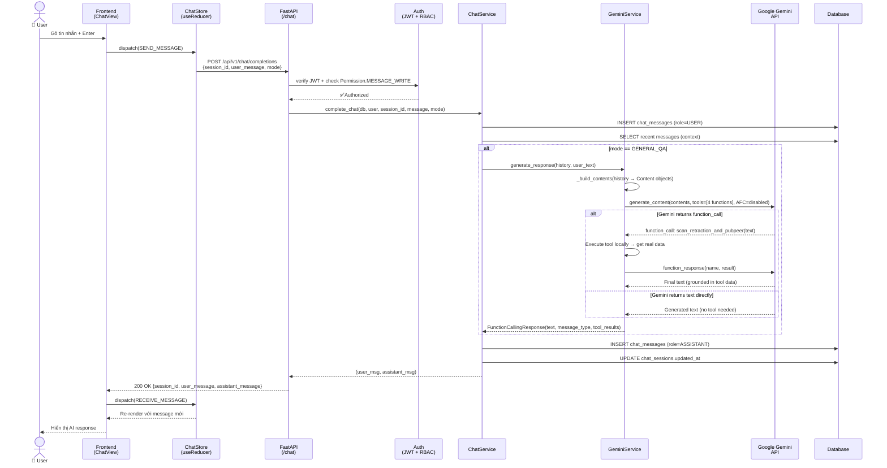
```mermaid
sequenceDiagram
    actor User as 👤 User
    participant FE as Frontend<br/>(ChatView)
    participant Store as ChatStore<br/>(useReducer)
    participant API as FastAPI<br/>(/chat)
    participant Auth as Auth<br/>(JWT + RBAC)
    participant ChatSvc as ChatService
    participant LLM as GeminiService
    participant Gemini as Google Gemini<br/>API
    participant DB as Database

    User->>FE: Gõ tin nhắn + Enter
    FE->>Store: dispatch(SEND_MESSAGE)
    Store->>API: POST /api/v1/chat/completions<br/>{session_id, user_message, mode}
    API->>Auth: verify JWT + check Permission.MESSAGE_WRITE
    Auth-->>API: ✅ Authorized
    API->>ChatSvc: complete_chat(db, user, session_id, message, mode)

    ChatSvc->>DB: INSERT chat_messages (role=USER)
    ChatSvc->>DB: SELECT recent messages (context)

    alt mode == GENERAL_QA
        ChatSvc->>LLM: generate_response(history, user_text)
        LLM->>LLM: _build_contents(history → Content objects)
        LLM->>Gemini: generate_content(contents, tools=[4 functions], AFC=disabled)
        alt Gemini returns function_call
            Gemini-->>LLM: function_call: scan_retraction_and_pubpeer(text)
            LLM->>LLM: Execute tool locally → get real data
            LLM->>Gemini: function_response(name, result)
            Gemini-->>LLM: Final text (grounded in tool data)
        else Gemini returns text directly
            Gemini-->>LLM: Generated text (no tool needed)
        end
        LLM-->>ChatSvc: FunctionCallingResponse(text, message_type, tool_results)
    end

    ChatSvc->>DB: INSERT chat_messages (role=ASSISTANT)
    ChatSvc->>DB: UPDATE chat_sessions.updated_at
    ChatSvc-->>API: (user_msg, assistant_msg)
    API-->>FE: 200 OK {session_id, user_message, assistant_message}
    FE->>Store: dispatch(RECEIVE_MESSAGE)
    Store-->>FE: Re-render với message mới
    FE-->>User: Hiển thị AI response
```

#### 5.2.3 Sequence Diagram — Citation Verification Tool

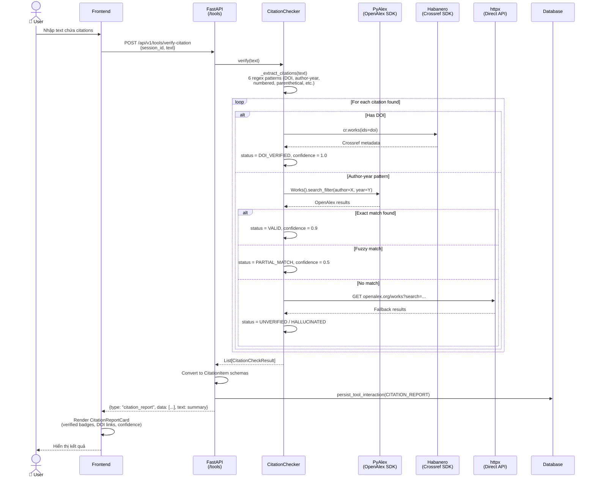
```mermaid
sequenceDiagram
    actor User as 👤 User
    participant FE as Frontend
    participant API as FastAPI<br/>(/tools)
    participant CitChk as CitationChecker
    participant PyAlex as PyAlex<br/>(OpenAlex SDK)
    participant Hab as Habanero<br/>(Crossref SDK)
    participant HTTPX as httpx<br/>(Direct API)
    participant DB as Database

    User->>FE: Nhập text chứa citations
    FE->>API: POST /api/v1/tools/verify-citation<br/>{session_id, text}

    API->>CitChk: verify(text)
    CitChk->>CitChk: _extract_citations(text)<br/>6 regex patterns (DOI, author-year,<br/>numbered, parenthetical, etc.)

    loop For each citation found
        alt Has DOI
            CitChk->>Hab: cr.works(ids=doi)
            Hab-->>CitChk: Crossref metadata
            CitChk->>CitChk: status = DOI_VERIFIED, confidence = 1.0
        else Author-year pattern
            CitChk->>PyAlex: Works().search_filter(author=X, year=Y)
            PyAlex-->>CitChk: OpenAlex results
            alt Exact match found
                CitChk->>CitChk: status = VALID, confidence = 0.9
            else Fuzzy match
                CitChk->>CitChk: status = PARTIAL_MATCH, confidence = 0.5
            else No match
                CitChk->>HTTPX: GET openalex.org/works?search=...
                HTTPX-->>CitChk: Fallback results
                CitChk->>CitChk: status = UNVERIFIED / HALLUCINATED
            end
        end
    end

    CitChk-->>API: List[CitationCheckResult]
    API->>API: Convert to CitationItem schemas
    API->>DB: persist_tool_interaction(CITATION_REPORT)
    API-->>FE: {type: "citation_report", data: [...], text: summary}
    FE->>FE: Render CitationReportCard<br/>(verified badges, DOI links, confidence)
    FE-->>User: Hiển thị kết quả
```

#### 5.2.4 Sequence Diagram — Journal Recommendation Tool

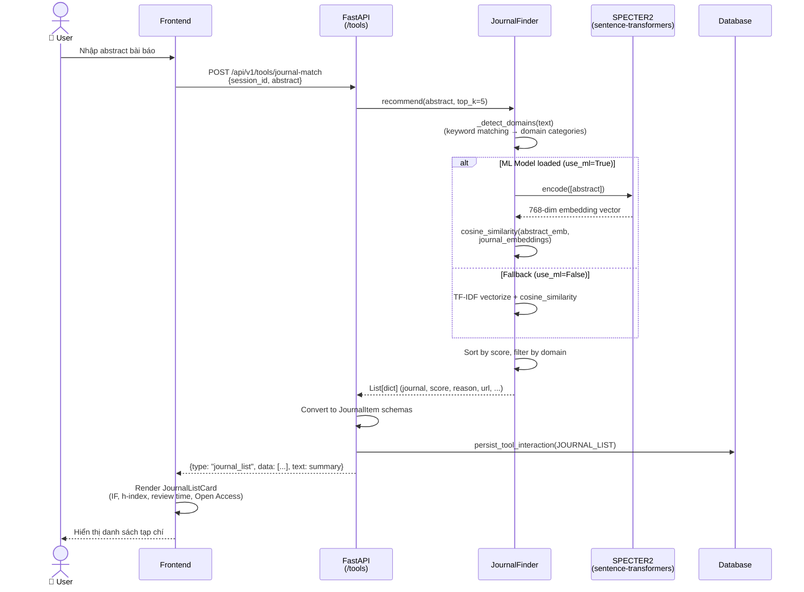
```mermaid
sequenceDiagram
    actor User as 👤 User
    participant FE as Frontend
    participant API as FastAPI<br/>(/tools)
    participant JF as JournalFinder
    participant Model as SPECTER2<br/>(sentence-transformers)
    participant DB as Database

    User->>FE: Nhập abstract bài báo
    FE->>API: POST /api/v1/tools/journal-match<br/>{session_id, abstract}

    API->>JF: recommend(abstract, top_k=5)
    JF->>JF: _detect_domains(text)<br/>(keyword matching → domain categories)

    alt ML Model loaded (use_ml=True)
        JF->>Model: encode([abstract])
        Model-->>JF: 768-dim embedding vector
        JF->>JF: cosine_similarity(abstract_emb,<br/>journal_embeddings)
    else Fallback (use_ml=False)
        JF->>JF: TF-IDF vectorize + cosine_similarity
    end

    JF->>JF: Sort by score, filter by domain
    JF-->>API: List[dict] (journal, score, reason, url, ...)

    API->>API: Convert to JournalItem schemas
    API->>DB: persist_tool_interaction(JOURNAL_LIST)
    API-->>FE: {type: "journal_list", data: [...], text: summary}
    FE->>FE: Render JournalListCard<br/>(IF, h-index, review time, Open Access)
    FE-->>User: Hiển thị danh sách tạp chí
```

#### 5.2.5 Sequence Diagram — File Upload & PDF Summary

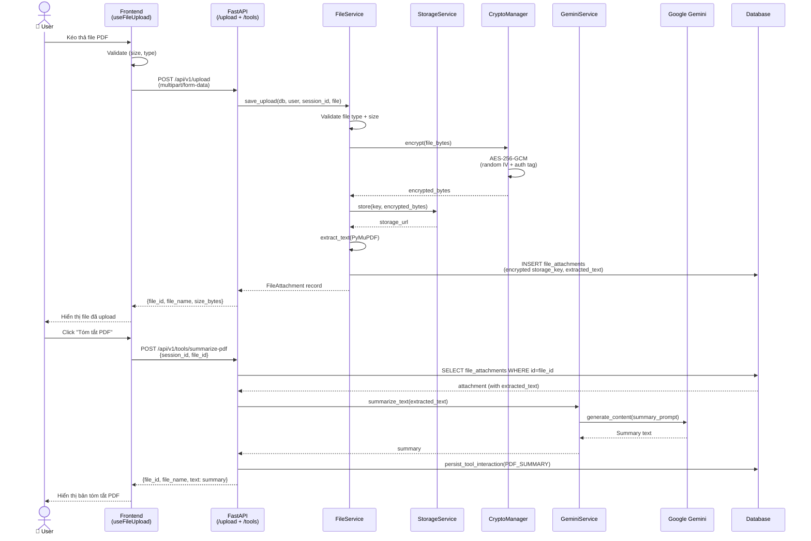
```mermaid
sequenceDiagram
    actor User as 👤 User
    participant FE as Frontend<br/>(useFileUpload)
    participant API as FastAPI<br/>(/upload + /tools)
    participant FileSvc as FileService
    participant Storage as StorageService
    participant Crypto as CryptoManager
    participant LLM as GeminiService
    participant Gemini as Google Gemini
    participant DB as Database

    User->>FE: Kéo thả file PDF
    FE->>FE: Validate (size, type)
    FE->>API: POST /api/v1/upload<br/>(multipart/form-data)

    API->>FileSvc: save_upload(db, user, session_id, file)
    FileSvc->>FileSvc: Validate file type + size
    FileSvc->>Crypto: encrypt(file_bytes)
    Crypto->>Crypto: AES-256-GCM<br/>(random IV + auth tag)
    Crypto-->>FileSvc: encrypted_bytes
    FileSvc->>Storage: store(key, encrypted_bytes)
    Storage-->>FileSvc: storage_url
    FileSvc->>FileSvc: extract_text(PyMuPDF)
    FileSvc->>DB: INSERT file_attachments<br/>(encrypted storage_key, extracted_text)
    FileSvc-->>API: FileAttachment record
    API-->>FE: {file_id, file_name, size_bytes}
    FE-->>User: Hiển thị file đã upload

    User->>FE: Click "Tóm tắt PDF"
    FE->>API: POST /api/v1/tools/summarize-pdf<br/>{session_id, file_id}
    API->>DB: SELECT file_attachments WHERE id=file_id
    DB-->>API: attachment (with extracted_text)
    API->>LLM: summarize_text(extracted_text)
    LLM->>Gemini: generate_content(summary_prompt)
    Gemini-->>LLM: Summary text
    LLM-->>API: summary
    API->>DB: persist_tool_interaction(PDF_SUMMARY)
    API-->>FE: {file_id, file_name, text: summary}
    FE-->>User: Hiển thị bản tóm tắt PDF
```

#### 5.2.6 Sequence Diagram — Retraction Scan

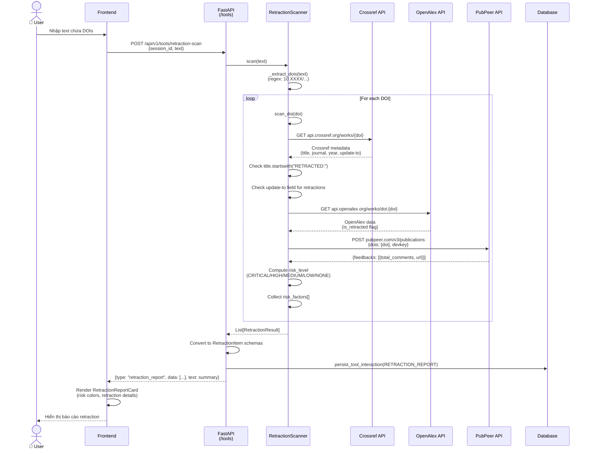
```mermaid
sequenceDiagram
    actor User as 👤 User
    participant FE as Frontend
    participant API as FastAPI<br/>(/tools)
    participant RS as RetractionScanner
    participant CR as Crossref API
    participant OA as OpenAlex API
    participant PP as PubPeer API
    participant DB as Database

    User->>FE: Nhập text chứa DOIs
    FE->>API: POST /api/v1/tools/retraction-scan<br/>{session_id, text}
    API->>RS: scan(text)
    RS->>RS: _extract_dois(text)<br/>(regex: 10.XXXX/...)

    loop For each DOI
        RS->>RS: scan_doi(doi)

        RS->>CR: GET api.crossref.org/works/{doi}
        CR-->>RS: Crossref metadata<br/>(title, journal, year, update-to)
        RS->>RS: Check title.startswith("RETRACTED:")
        RS->>RS: Check update-to field for retractions

        RS->>OA: GET api.openalex.org/works/doi:{doi}
        OA-->>RS: OpenAlex data<br/>(is_retracted flag)

        RS->>PP: POST pubpeer.com/v3/publications<br/>{dois: [doi], devkey}
        PP-->>RS: {feedbacks: [{total_comments, url}]}

        RS->>RS: Compute risk_level<br/>(CRITICAL/HIGH/MEDIUM/LOW/NONE)
        RS->>RS: Collect risk_factors[]
    end

    RS-->>API: List[RetractionResult]
    API->>API: Convert to RetractionItem schemas
    API->>DB: persist_tool_interaction(RETRACTION_REPORT)
    API-->>FE: {type: "retraction_report", data: [...], text: summary}
    FE->>FE: Render RetractionReportCard<br/>(risk colors, retraction details)
    FE-->>User: Hiển thị báo cáo retraction
```

---

## 6. Thiết kế Cơ sở dữ liệu (ERD)

### 6.1 Lược đồ Quan hệ Thực thể (Entity Relationship Diagram)

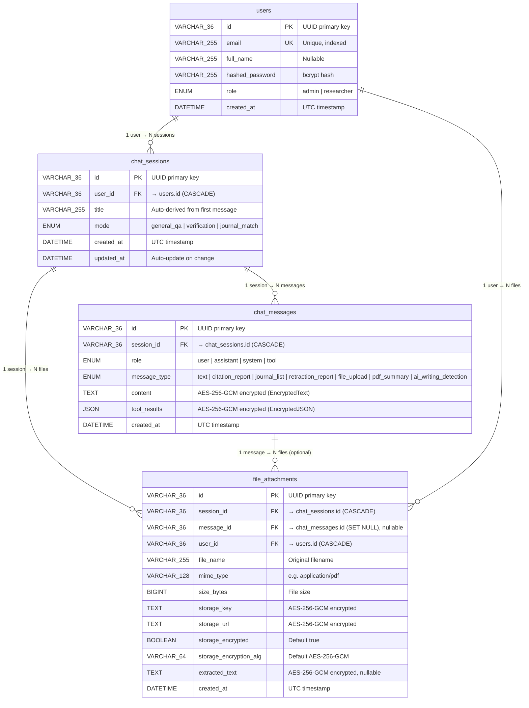
```mermaid
erDiagram
    users {
        VARCHAR_36 id PK "UUID primary key"
        VARCHAR_255 email UK "Unique, indexed"
        VARCHAR_255 full_name "Nullable"
        VARCHAR_255 hashed_password "bcrypt hash"
        ENUM role "admin | researcher"
        DATETIME created_at "UTC timestamp"
    }

    chat_sessions {
        VARCHAR_36 id PK "UUID primary key"
        VARCHAR_36 user_id FK "→ users.id (CASCADE)"
        VARCHAR_255 title "Auto-derived from first message"
        ENUM mode "general_qa | verification | journal_match"
        DATETIME created_at "UTC timestamp"
        DATETIME updated_at "Auto-update on change"
    }

    chat_messages {
        VARCHAR_36 id PK "UUID primary key"
        VARCHAR_36 session_id FK "→ chat_sessions.id (CASCADE)"
        ENUM role "user | assistant | system | tool"
        ENUM message_type "text | citation_report | journal_list | retraction_report | file_upload | pdf_summary | ai_writing_detection"
        TEXT content "AES-256-GCM encrypted (EncryptedText)"
        JSON tool_results "AES-256-GCM encrypted (EncryptedJSON)"
        DATETIME created_at "UTC timestamp"
    }

    file_attachments {
        VARCHAR_36 id PK "UUID primary key"
        VARCHAR_36 session_id FK "→ chat_sessions.id (CASCADE)"
        VARCHAR_36 message_id FK "→ chat_messages.id (SET NULL), nullable"
        VARCHAR_36 user_id FK "→ users.id (CASCADE)"
        VARCHAR_255 file_name "Original filename"
        VARCHAR_128 mime_type "e.g. application/pdf"
        BIGINT size_bytes "File size"
        TEXT storage_key "AES-256-GCM encrypted"
        TEXT storage_url "AES-256-GCM encrypted"
        BOOLEAN storage_encrypted "Default true"
        VARCHAR_64 storage_encryption_alg "Default AES-256-GCM"
        TEXT extracted_text "AES-256-GCM encrypted, nullable"
        DATETIME created_at "UTC timestamp"
    }

    users ||--o{ chat_sessions : "1 user → N sessions"
    chat_sessions ||--o{ chat_messages : "1 session → N messages"
    chat_sessions ||--o{ file_attachments : "1 session → N files"
    chat_messages ||--o{ file_attachments : "1 message → N files (optional)"
    users ||--o{ file_attachments : "1 user → N files"
```

### 6.2 Chi tiết Bảng & Ràng buộc

#### Bảng `users`

| Column | Type | Constraints | Mô tả |
|--------|------|-------------|-------|
| `id` | VARCHAR(36) | PK, DEFAULT uuid4() | UUID định danh |
| `email` | VARCHAR(255) | UNIQUE, NOT NULL, INDEX | Email đăng nhập |
| `full_name` | VARCHAR(255) | NULLABLE | Tên đầy đủ |
| `hashed_password` | VARCHAR(255) | NOT NULL | bcrypt hash ($2b$12$...) |
| `role` | ENUM('admin','researcher') | NOT NULL, DEFAULT 'researcher' | Vai trò trong hệ thống |
| `created_at` | DATETIME(tz) | NOT NULL, DEFAULT now(UTC) | Thời gian tạo |

#### Bảng `chat_sessions`

| Column | Type | Constraints | Mô tả |
|--------|------|-------------|-------|
| `id` | VARCHAR(36) | PK, DEFAULT uuid4() | UUID phiên chat |
| `user_id` | VARCHAR(36) | FK → users.id, ON DELETE CASCADE, INDEX | Chủ sở hữu |
| `title` | VARCHAR(255) | DEFAULT 'New Chat' | Tiêu đề (auto-derived) |
| `mode` | ENUM('general_qa','verification','journal_match') | NOT NULL, DEFAULT 'general_qa' | Chế độ hoạt động |
| `created_at` | DATETIME(tz) | NOT NULL | Thời gian tạo |
| `updated_at` | DATETIME(tz) | NOT NULL, ON UPDATE now(UTC) | Thời gian cập nhật |

#### Bảng `chat_messages`

| Column | Type | Constraints | Mô tả |
|--------|------|-------------|-------|
| `id` | VARCHAR(36) | PK, DEFAULT uuid4() | UUID tin nhắn |
| `session_id` | VARCHAR(36) | FK → chat_sessions.id, ON DELETE CASCADE, INDEX | Phiên chat chứa message |
| `role` | ENUM('user','assistant','system','tool') | NOT NULL | Vai trò gửi message |
| `message_type` | ENUM(7 types) | NOT NULL, DEFAULT 'text' | Loại nội dung |
| `content` | TEXT (EncryptedText) | NULLABLE | Nội dung — mã hóa AES-256-GCM |
| `tool_results` | JSON (EncryptedJSON) | NULLABLE | Kết quả tool — mã hóa AES-256-GCM |
| `created_at` | DATETIME(tz) | NOT NULL | Thời gian tạo |

**Composite Index**: `ix_chatmsg_session_created(session_id, created_at)` — tối ưu query lấy messages theo session, sắp xếp theo thời gian.

#### Bảng `file_attachments`

| Column | Type | Constraints | Mô tả |
|--------|------|-------------|-------|
| `id` | VARCHAR(36) | PK, DEFAULT uuid4() | UUID file |
| `session_id` | VARCHAR(36) | FK → chat_sessions.id, ON DELETE CASCADE, INDEX | Phiên chat chứa file |
| `message_id` | VARCHAR(36) | FK → chat_messages.id, ON DELETE SET NULL, INDEX, NULLABLE | Message liên kết (optional) |
| `user_id` | VARCHAR(36) | FK → users.id, ON DELETE CASCADE, INDEX | Người upload |
| `file_name` | VARCHAR(255) | NOT NULL | Tên file gốc |
| `mime_type` | VARCHAR(128) | NOT NULL | MIME type (application/pdf, ...) |
| `size_bytes` | BIGINT | NOT NULL | Kích thước file (bytes) |
| `storage_key` | TEXT (EncryptedText) | NOT NULL | Đường dẫn lưu trữ — mã hóa |
| `storage_url` | TEXT (EncryptedText) | NOT NULL | URL truy cập — mã hóa |
| `storage_encrypted` | BOOLEAN | DEFAULT TRUE | File có mã hóa at-rest |
| `storage_encryption_alg` | VARCHAR(64) | DEFAULT 'AES-256-GCM' | Thuật toán mã hóa |
| `extracted_text` | TEXT (EncryptedText) | NULLABLE | Text trích xuất từ PDF — mã hóa |
| `created_at` | DATETIME(tz) | NOT NULL | Thời gian upload |

**Composite Indexes**:
- `ix_fileatt_session_created(session_id, created_at)` — truy vấn files theo session
- `ix_fileatt_user_created(user_id, created_at)` — truy vấn files theo user

### 6.3 Mối quan hệ (Relationships)

| Quan hệ | Loại | ON DELETE | Mô tả |
|----------|------|-----------|-------|
| `users` → `chat_sessions` | 1:N | CASCADE | Xóa user → xóa tất cả sessions |
| `chat_sessions` → `chat_messages` | 1:N | CASCADE | Xóa session → xóa tất cả messages |
| `chat_sessions` → `file_attachments` | 1:N | CASCADE | Xóa session → xóa metadata files |
| `chat_messages` → `file_attachments` | 1:N | SET NULL | Xóa message → giữ file, set message_id = NULL |
| `users` → `file_attachments` | 1:N | CASCADE | Xóa user → xóa tất cả files |

### 6.4 Encryption Schema

Các cột được đánh dấu `EncryptedText` / `EncryptedJSON` sử dụng SQLAlchemy custom types trong `core/encrypted_types.py`:

```
Plaintext → AES-256-GCM encrypt(master_key, random_iv) → Base64 encode → Store in DB
DB read → Base64 decode → AES-256-GCM decrypt(master_key, iv, tag) → Plaintext
```

| Bảng | Cột được mã hóa | Type |
|------|-----------------|------|
| `chat_messages` | `content` | EncryptedText |
| `chat_messages` | `tool_results` | EncryptedJSON |
| `file_attachments` | `storage_key` | EncryptedText |
| `file_attachments` | `storage_url` | EncryptedText |
| `file_attachments` | `extracted_text` | EncryptedText |

### 6.5 Sample Data (JSON Demo)

#### User record
```json
{
  "id": "a1b2c3d4-e5f6-7890-abcd-ef1234567890",
  "email": "researcher@university.edu",
  "full_name": "Nguyễn Văn A",
  "hashed_password": "$2b$12$LJ4kAePz6qG2...",
  "role": "researcher",
  "created_at": "2026-02-28T10:00:00+00:00"
}
```

#### Chat Session record
```json
{
  "id": "s1234567-abcd-ef01-2345-678901234567",
  "user_id": "a1b2c3d4-e5f6-7890-abcd-ef1234567890",
  "title": "Deep learning NLP research",
  "mode": "general_qa",
  "created_at": "2026-02-28T10:05:00+00:00",
  "updated_at": "2026-02-28T10:30:00+00:00"
}
```

#### Chat Message record (tool result)
```json
{
  "id": "m9876543-dcba-0fed-5432-109876543210",
  "session_id": "s1234567-abcd-ef01-2345-678901234567",
  "role": "assistant",
  "message_type": "citation_report",
  "content": "ENC:AES256GCM:base64(iv+ciphertext+tag)...",
  "tool_results": "ENC:AES256GCM:base64({\"type\":\"citation_report\",\"data\":[{\"citation\":\"10.1038/nature12373\",\"status\":\"DOI_VERIFIED\",\"confidence\":1.0,\"doi\":\"10.1038/nature12373\",\"title\":\"Nanometre-scale thermometry in a living cell\",\"authors\":[\"Kucsko G.\",\"Maurer P. C.\"],\"year\":2013,\"source\":\"crossref\"}]})...",
  "created_at": "2026-02-28T10:10:00+00:00"
}
```

#### File Attachment record
```json
{
  "id": "f5678901-2345-6789-0abc-def012345678",
  "session_id": "s1234567-abcd-ef01-2345-678901234567",
  "message_id": null,
  "user_id": "a1b2c3d4-e5f6-7890-abcd-ef1234567890",
  "file_name": "research_paper.pdf",
  "mime_type": "application/pdf",
  "size_bytes": 2458624,
  "storage_key": "ENC:AES256GCM:base64(...)...",
  "storage_url": "ENC:AES256GCM:base64(...)...",
  "storage_encrypted": true,
  "storage_encryption_alg": "AES-256-GCM",
  "extracted_text": "ENC:AES256GCM:base64(Introduction: This paper presents...)...",
  "created_at": "2026-02-28T10:08:00+00:00"
}
```

---

## 7. Tích hợp API & Dịch vụ bên ngoài (API Integrations & Third-Party Services)

Phần này mô tả chi tiết tất cả các tích hợp với dịch vụ/API bên ngoài mà hệ thống AIRA sử dụng, bao gồm: vai trò, phương thức tích hợp, cơ chế fallback, và trạng thái hiện tại.

### 7.1 Tổng quan Integrations


```mermaid
graph TB
    subgraph AIRA["🏗️ AIRA Backend"]
        LLM["LLM Service<br/>(GeminiService)"]
        CC["Citation Checker"]
        JF["Journal Finder"]
        RS["Retraction Scanner"]
        AW["AI Writing Detector"]
        FS["File Service"]
        SS["Storage Service"]
        AUTH["Auth Service"]
    end

    subgraph External_APIs["🌐 External APIs"]
        GEMINI["Google Gemini API<br/>gemini-flash-latest<br/>+ Function Calling"]
        OA["OpenAlex API<br/>api.openalex.org"]
        CR["Crossref API<br/>api.crossref.org"]
        PP["PubPeer API v3<br/>pubpeer.com/v3"]
    end

    subgraph ML_Models["🧠 ML Models (HuggingFace)"]
        SP["SPECTER2<br/>allenai/specter2_base"]
        RB["RoBERTa<br/>roberta-base-openai-detector"]
        HF["HuggingFace Hub<br/>Model Downloads"]
    end

    subgraph Infrastructure["⚙️ Infrastructure"]
        DB["SQLAlchemy<br/>SQLite / PostgreSQL"]
        S3["AWS S3<br/>boto3"]
        CRYPTO["PyCryptodome<br/>AES-256-GCM"]
        JWT_LIB["python-jose<br/>JWT HS256"]
        BCRYPT["bcrypt<br/>Password Hashing"]
    end

    subgraph Document["📄 Document Processing"]
        PDF["PyMuPDF (fitz)<br/>PDF Text Extraction"]
    end

    LLM -->|google-genai SDK| GEMINI
    CC -->|pyalex SDK| OA
    CC -->|habanero SDK| CR
    RS -->|habanero SDK| CR
    RS -->|httpx| OA
    RS -->|httpx POST| PP
    JF -->|sentence-transformers| SP
    JF -->|huggingface-hub| HF
    AW -->|transformers| RB
    FS --> PDF
    SS --> S3
    AUTH --> JWT_LIB
    AUTH --> BCRYPT

    classDef dead fill:#ff6b6b,stroke:#c0392b,color:#fff
    classDef ok fill:#2ecc71,stroke:#27ae60,color:#fff
    classDef warn fill:#f39c12,stroke:#e67e22,color:#fff
    classDef ml fill:#9b59b6,stroke:#8e44ad,color:#fff

    class PP ok
    class GEMINI,OA,CR ok
    class SP,RB,HF ml
    class DB,S3,CRYPTO,JWT_LIB,BCRYPT,PDF ok
```

### 7.2 Google Gemini API — Function Calling Architecture

| Thuộc tính | Chi tiết |
|-----------|---------|
| **Vai trò** | LLM chính — tạo phản hồi chat, **gọi tool tự động qua Function Calling**, tóm tắt PDF |
| **SDK** | `google-genai` ≥ 1.0.0 (thay thế deprecated `google-generativeai`) |
| **Model** | `gemini-flash-latest` (cấu hình qua `settings.gemini_model`) |
| **Auth** | API Key qua biến môi trường `GOOGLE_API_KEY` |
| **File** | `backend/app/services/llm_service.py` |
| **Function Calling** | ✅ 4 tool functions registered, manual FC loop (AFC disabled) |
| **System Prompt** | Vietnamese anti-hallucination prompt (SYSTEM_PROMPT constant, 955 chars) |
| **Trạng thái** | ✅ Hoạt động — tool calls verified end-to-end |

#### 7.2.1 Function Calling — Tổng quan

Gemini **không bao giờ tự bịa dữ liệu học thuật**. Thay vào đó, khi user hỏi về retraction, citation, journal, hoặc AI detection, Gemini sẽ tự động gọi tool functions thực thi ở backend, nhận kết quả thực, rồi tổng hợp câu trả lời dựa trên dữ liệu đó.

**4 Tool Functions đã đăng ký:**

| Tên Function | Mô tả | Backend Tool |
|-------------|-------|-------------|
| `scan_retraction_and_pubpeer(text)` | Quét DOI → retraction status, PubPeer comments, risk level | `retraction_scanner.scan()` |
| `verify_citation(text)` | Xác minh citation qua OpenAlex + Crossref | `citation_checker.verify()` |
| `match_journal(abstract, title)` | Tìm journal phù hợp bằng SPECTER2 embedding | `journal_finder.recommend()` |
| `detect_ai_writing(text)` | Phát hiện AI viết bằng RoBERTa ensemble | `ai_writing_detector.analyze()` |

#### 7.2.2 Function Calling Flow

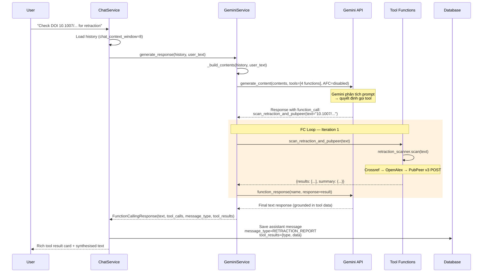
```mermaid
sequenceDiagram
    participant U as User
    participant CS as ChatService
    participant GS as GeminiService
    participant G as Gemini API
    participant T as Tool Functions
    participant DB as Database

    U->>CS: "Check DOI 10.1007/... for retraction"
    CS->>CS: Load history (chat_context_window=8)
    CS->>GS: generate_response(history, user_text)
    GS->>GS: _build_contents(history, user_text)
    GS->>G: generate_content(contents, tools=[4 functions], AFC=disabled)

    Note over G: Gemini phân tích prompt<br/>→ quyết định gọi tool

    G-->>GS: Response with function_call:<br/>scan_retraction_and_pubpeer(text="10.1007/...")

    rect rgb(255, 243, 224)
        Note over GS,T: FC Loop — Iteration 1
        GS->>T: scan_retraction_and_pubpeer(text)
        T->>T: retraction_scanner.scan(text)
        Note over T: Crossref → OpenAlex → PubPeer v3 POST
        T-->>GS: {results: [...], summary: {...}}
        GS->>G: function_response(name, response=result)
    end

    G-->>GS: Final text response (grounded in tool data)
    GS-->>CS: FunctionCallingResponse(text, tool_calls, message_type, tool_results)

    CS->>DB: Save assistant message<br/>message_type=RETRACTION_REPORT<br/>tool_results={type, data}
    CS-->>U: Rich tool result card + synthesised text
```

#### 7.2.3 Phương thức tích hợp

```python
from google import genai
from google.genai import types as genai_types

# Khởi tạo client
client = genai.Client(api_key=settings.google_api_key)

# Tool functions — Python callables with docstrings
def scan_retraction_and_pubpeer(text: str) -> dict:
    """Scan DOIs for retraction status and PubPeer comments."""
    results = retraction_scanner.scan(text)
    return {"results": [...], "summary": {...}}

# FC loop (AFC disabled — manual control)
config = genai_types.GenerateContentConfig(
    system_instruction=SYSTEM_PROMPT,
    tools=[scan_retraction_and_pubpeer, verify_citation,
           match_journal, detect_ai_writing],
    automatic_function_calling=genai_types.AutomaticFunctionCallingConfig(
        disable=True,  # Manual loop for tracking & error handling
    ),
)

response = client.models.generate_content(
    model="gemini-flash-latest",
    contents=contents,  # Multi-turn Content objects
    config=config,
)

# Check for function_call in response
for part in response.candidates[0].content.parts:
    if part.function_call:
        result = _execute_function_call(part.function_call)
        # Send function_response back → Gemini synthesises final answer
```

#### 7.2.4 FC Loop Architecture

```mermaid
flowchart TD
    A[User Prompt + History] --> B[Build Contents<br/>Multi-turn Content objects]
    B --> C[generate_content<br/>with tools + AFC disabled]
    C --> D{Response has<br/>function_call?}

    D -->|Yes| E[Execute function locally]
    E --> F[Append model response<br/>+ function_response to contents]
    F --> G{Iteration < 5?}
    G -->|Yes| C
    G -->|No| H[Return budget-exceeded message]

    D -->|No| I[Extract final text]
    I --> J{Any tools<br/>called earlier?}
    J -->|Yes| K[Build FunctionCallingResponse<br/>with message_type + tool_results]
    J -->|No| L[Build FunctionCallingResponse<br/>message_type=TEXT]
    K --> M[Return to ChatService]
    L --> M

    style E fill:#3498db,stroke:#2980b9,color:#fff
    style K fill:#2ecc71,stroke:#27ae60
    style L fill:#95a5a6,stroke:#7f8c8d
    style H fill:#e74c3c,stroke:#c0392b,color:#fff
```

#### 7.2.5 System Prompt (Anti-Hallucination)

```
Bạn là AIRA — trợ lý nghiên cứu học thuật chuyên nghiệp.

### QUY TẮC BẮT BUỘC:
1. KHÔNG BAO GIỜ bịa dữ liệu học thuật (DOI, citation, journal, PubPeer...)
2. LUÔN gọi tool khi cần dữ liệu thực:
   - Retraction/PubPeer → scan_retraction_and_pubpeer
   - Citation → verify_citation
   - Journal matching → match_journal
   - AI detection → detect_ai_writing
3. Nếu không có tool phù hợp → ghi rõ "kiến thức chung, chưa xác minh"
4. Kết quả tool = DỮ LIỆU THỰC — trình bày chính xác
5. Trả lời tiếng Việt (trừ khi user viết tiếng Anh)
6. Ngắn gọn, chính xác, học thuật
```

#### 7.2.6 Cơ chế Fallback

- Nếu `GOOGLE_API_KEY` không set → log warning, disable Gemini, trả message mặc định
- Nếu SDK `google-genai` không cài → disable Gemini
- Nếu tool execution fail → trả `{"error": "..."}` → Gemini nhận lỗi, thông báo cho user
- Nếu FC loop vượt 5 iterations → trả budget-exceeded message
- Nếu API call thất bại (network, quota) → trả message lỗi thân thiện, KHÔNG crash
- `summarize_text()` sử dụng `generate_simple()` (không có tools) với fallback cắt text

#### 7.2.7 FunctionCallingResponse Dataclass

```python
@dataclass
class FunctionCallingResponse:
    text: str                            # Final synthesised answer
    tool_calls: list[dict] = []          # [{name, args, result}, ...]
    message_type: str = "text"           # "retraction_report" | "citation_report" | ...
    tool_results: dict | None = None     # {type: "...", data: [...]} for frontend rendering
```

`ChatService` sử dụng `message_type` và `tool_results` để lưu tin nhắn với đúng `MessageType` enum → frontend render rich tool-result components (JournalListCard, CitationReportCard, etc.).

### 7.3 OpenAlex API

| Thuộc tính | Chi tiết |
|-----------|---------|
| **Vai trò** | Cơ sở dữ liệu học thuật mở — xác minh citation, kiểm tra retraction status |
| **SDK chính** | `pyalex` ≥ 0.13 (Python wrapper cho OpenAlex REST API) |
| **HTTP fallback** | `httpx` gọi trực tiếp `https://api.openalex.org/works` |
| **Auth** | Không yêu cầu (public API, polite pool qua email) |
| **Base URL** | `https://api.openalex.org` |
| **Sử dụng bởi** | `citation_checker.py`, `retraction_scan.py` |
| **Trạng thái** | ✅ Hoạt động (latency ~2.0s, 2.6M+ works indexed) |

**Phương thức tích hợp — Citation Checker:**

```python
# Cách 1: PyAlex SDK (ưu tiên)
from pyalex import Works

works = Works().search(title_query).get(per_page=5)
for work in works:
    # work["doi"], work["title"], work["authorships"]

# Cách 2: httpx fallback (khi PyAlex fail)
import httpx
r = httpx.get(
    "https://api.openalex.org/works",
    params={"search": title_query, "per_page": 5},
    timeout=10.0,
)
data = r.json()["results"]
```

**Phương thức tích hợp — Retraction Scanner:**

```python
# Kiểm tra retraction status qua OpenAlex
import httpx
r = httpx.get(
    f"https://api.openalex.org/works/https://doi.org/{doi}",
    timeout=12.0,
)
work = r.json()
is_retracted = work.get("is_retracted", False)
```

**Cơ chế Fallback:**
- PyAlex SDK failure → chuyển sang httpx HTTP trực tiếp
- httpx failure → trả `UNVERIFIED` status, không crash
- `httpx.Client(timeout=10.0)` với transport `retries=2`

### 7.4 Crossref API

| Thuộc tính | Chi tiết |
|-----------|---------|
| **Vai trò** | Metadata DOI — xác minh citation qua DOI, kiểm tra retraction/correction |
| **SDK chính** | `habanero` ≥ 1.2.0 (Python wrapper cho Crossref REST API) |
| **HTTP fallback** | `httpx` gọi trực tiếp `https://api.crossref.org/works/{doi}` |
| **Auth** | Không yêu cầu (public API, polite pool qua `mailto`) |
| **Base URL** | `https://api.crossref.org` |
| **Sử dụng bởi** | `citation_checker.py`, `retraction_scan.py` |
| **Trạng thái** | ✅ Hoạt động (latency ~1.0s) |

**Phương thức tích hợp — Citation Checker (DOI verification):**

```python
# Cách 1: Habanero SDK (ưu tiên)
from habanero import Crossref
cr = Crossref()
result = cr.works(ids=doi)
metadata = result["message"]
# metadata["title"], metadata["author"], metadata["DOI"]

# Cách 2: httpx fallback
import httpx
r = httpx.get(f"https://api.crossref.org/works/{doi}", timeout=10.0)
metadata = r.json()["message"]
```

**Phương thức tích hợp — Retraction Scanner (update-to check):**

```python
from habanero import Crossref
cr = Crossref()
result = cr.works(ids=doi)
msg = result["message"]

# Kiểm tra retraction/correction qua "update-to" field
for update in msg.get("update-to", []):
    if update.get("type") == "retraction":
        # Paper đã bị retract
    elif update.get("type") == "correction":
        # Paper có correction

# Fallback: kiểm tra title prefix "RETRACTED:"
title = msg.get("title", [""])[0]
if title.upper().startswith("RETRACTED:"):
    # Paper đã bị retract (phát hiện qua title)
```

**Cơ chế Fallback:**
- Habanero SDK failure → chuyển sang httpx HTTP trực tiếp
- httpx failure → trả `UNVERIFIED`, không crash
- `httpx.HTTPTransport(retries=2)` cho reliability
- Crossref `update-to` field không đáng tin (rỗng cho nhiều paper đã retract) → bổ sung title-based detection

### 7.5 PubPeer API

| Thuộc tính | Chi tiết |
|-----------|---------|
| **Vai trò** | Kiểm tra post-publication peer review comments |
| **HTTP Client** | `httpx` — **POST** request |
| **Endpoint** | `POST https://pubpeer.com/v3/publications?devkey=PubMedChrome` |
| **Auth** | Public devkey `PubMedChrome` (query parameter) |
| **Sử dụng bởi** | `retraction_scan.py` |
| **Trạng thái** | ✅ **Hoạt động** (latency ~0.4s) |

> **Lưu ý lịch sử**: API v1 (`GET /v1/publications`) đã ngừng hoạt động (trả 404 HTML). Hệ thống hiện dùng API v3 với `POST` method và JSON body.

**Phương thức tích hợp:**

```python
import httpx

PUBPEER_API_URL = "https://pubpeer.com/v3/publications"
PUBPEER_DEVKEY = "PubMedChrome"

resp = client.post(
    f"{PUBPEER_API_URL}?devkey={PUBPEER_DEVKEY}",
    json={"dois": [doi]},
    headers={
        "User-Agent": "AIRA-ResearchAssistant/1.0 (mailto:24521236@gm.uit.edu.vn)",
        "Content-Type": "application/json",
    },
)
data = resp.json()
feedbacks = data.get("feedbacks", [])

if not feedbacks:
    # Paper sạch — không có bình luận trên PubPeer
    result = {"has_comments": False, "total_comments": 0, "url": None}
else:
    fb = feedbacks[0]
    result = {
        "has_comments": True,
        "total_comments": fb.get("total_comments", 0),
        "url": fb.get("url"),  # Direct link đến bài trên PubPeer
    }
```

**Cấu trúc Response từ PubPeer v3:**
```json
{
  "feedbacks": [
    {
      "id": 12345,
      "total_comments": 4,
      "url": "https://pubpeer.com/publications/ABC123...",
      "title": "Paper Title...",
      "comments": [...]
    }
  ]
}
```

- `feedbacks` rỗng (`[]`) → paper không có bình luận → an toàn
- `feedbacks[0].total_comments > 0` → paper có bình luận → cần xem xét
- `feedbacks[0].url` → link trực tiếp đến trang thảo luận trên PubPeer

**Cơ chế Fallback:**
- HTTP error (4xx, 5xx) → `pubpeer_comments = 0`, log warning
- Network error → `pubpeer_comments = 0`, log warning  
- Luôn cung cấp manual search URL backup: `https://pubpeer.com/search?q={doi}`
- Bắt riêng `httpx.RequestError` và `httpx.HTTPStatusError` — KHÔNG crash app

```mermaid
flowchart LR
    A[scan_doi] --> B["httpx POST<br/>pubpeer.com/v3/publications<br/>?devkey=PubMedChrome<br/>{dois: [doi]}"]
    B --> C{status == 200?}
    C -->|Yes| D{feedbacks<br/>not empty?}
    D -->|Yes| E["✅ has_comments=True<br/>total_comments=N<br/>url=direct_link"]
    D -->|No| F["✅ has_comments=False<br/>total_comments=0<br/>(paper sạch)"]
    C -->|No| G["⚠️ pubpeer_comments=0<br/>url=manual search link"]
    B -->|Exception| G

    style E fill:#e74c3c,stroke:#c0392b,color:#fff
    style F fill:#2ecc71,stroke:#27ae60
    style G fill:#f39c12,stroke:#e67e22
```

### 7.6 HuggingFace Hub & Model Downloads

| Thuộc tính | Chi tiết |
|-----------|---------|
| **Vai trò** | Tải và cache ML models từ HuggingFace Model Hub |
| **SDK** | `huggingface-hub` ≥ 0.20 |
| **Auth** | `HF_TOKEN` (optional, cho private/gated models) |
| **Sử dụng bởi** | `journal_finder.py` (SPECTER2, SciBERT), `ai_writing_detector.py` (RoBERTa) |
| **Cache** | `~/.cache/huggingface/hub/` (auto-cached sau lần tải đầu) |
| **Trạng thái** | ✅ Hoạt động |

**Phương thức tích hợp:**

```python
import os
from dotenv import load_dotenv
load_dotenv()  # Load HF_TOKEN từ .env

from huggingface_hub import login
token = os.environ.get("HF_TOKEN", "").strip()
if token:
    login(token=token, add_to_git_credential=False)
    # "HF_TOKEN is set and is the current active token"
```

**Cơ chế Fallback — Offline Mode:**
```python
# Thử online → nếu fail → thử local cache
for model_name in MODEL_CANDIDATES:
    try:
        model = SentenceTransformer(model_name, local_files_only=False)
        return model
    except Exception:
        try:
            model = SentenceTransformer(model_name, local_files_only=True)
            return model
        except Exception:
            continue
# Nếu tất cả fail → TF-IDF fallback (không cần ML model)
```

### 7.7 SPECTER2 — Scientific Paper Embeddings

| Thuộc tính | Chi tiết |
|-----------|---------|
| **Vai trò** | Tạo sentence embeddings cho abstract → so sánh cosine similarity với journal scope |
| **Model** | `allenai/specter2_base` (768 dimensions) |
| **SDK** | `sentence-transformers` ≥ 2.2 |
| **File** | `backend/app/services/tools/journal_finder.py` |
| **Latency** | ~0.2s (cached) / ~3.9s (first load) |
| **Trạng thái** | ✅ Hoạt động (cached locally) |

**Phương thức tích hợp:**

```python
from sentence_transformers import SentenceTransformer

# Model candidate chain (fallback tự động)
MODEL_CANDIDATES = [
    "allenai/specter2_base",                     # Tốt nhất cho scientific text
    "allenai/scibert_scivocab_uncased",          # Backup 1
    "sentence-transformers/all-MiniLM-L6-v2",   # Backup 2 (general-purpose)
]

model = SentenceTransformer("allenai/specter2_base")

# Tạo embeddings
query_embedding = model.encode(["abstract text"], convert_to_numpy=True)
journal_embedding = model.encode(["journal scope text"], convert_to_numpy=True)

# Cosine similarity
similarity = np.dot(query_embedding, journal_embedding) / (
    np.linalg.norm(query_embedding) * np.linalg.norm(journal_embedding)
)
```

**Cơ chế Fallback (3 tầng):**

```mermaid
flowchart TD
    A[Load SPECTER2<br/>allenai/specter2_base] -->|Success| B[✅ 768-dim embeddings]
    A -->|Fail| C[Load SciBERT<br/>scibert_scivocab_uncased]
    C -->|Success| B
    C -->|Fail| D[Load MiniLM<br/>all-MiniLM-L6-v2]
    D -->|Success| E[✅ 384-dim embeddings]
    D -->|Fail| F[TF-IDF Fallback<br/>scikit-learn CountVectorizer]
    F --> G[✅ Keyword matching<br/>không cần ML]

    style B fill:#2ecc71,stroke:#27ae60
    style E fill:#f39c12,stroke:#e67e22
    style G fill:#e74c3c,stroke:#c0392b,color:#fff
```

### 7.8 RoBERTa — AI Writing Detection

| Thuộc tính | Chi tiết |
|-----------|---------|
| **Vai trò** | Phát hiện văn bản được tạo bởi AI (GPT-2 detector) |
| **Model** | `roberta-base-openai-detector` (OpenAI GPT-2 Output Detector) |
| **SDK** | `transformers` + `torch` (PyTorch CPU) |
| **File** | `backend/app/services/tools/ai_writing_detector.py` |
| **Ensemble** | 70% ML score + 30% rule-based score |
| **Latency** | ~0.1s (cached) / ~4.8s (first load) |
| **Trạng thái** | ✅ Hoạt động |

**Phương thức tích hợp:**

```python
from transformers import AutoTokenizer, AutoModelForSequenceClassification
import torch

# Load model
tokenizer = AutoTokenizer.from_pretrained("roberta-base-openai-detector")
model = AutoModelForSequenceClassification.from_pretrained("roberta-base-openai-detector")

# Inference
inputs = tokenizer(text, return_tensors="pt", truncation=True, max_length=512)
with torch.no_grad():
    logits = model(**inputs).logits
    probs = torch.softmax(logits, dim=-1)
    ai_prob = probs[0][0].item()  # P(AI-generated)

# Ensemble: 70% ML + 30% rule-based
final_score = 0.7 * ai_prob + 0.3 * rule_based_score
```

**Rule-based Features (7 chỉ số):**

| # | Feature | Mô tả | Ngưỡng AI |
|---|---------|--------|-----------|
| 1 | TTR (Type-Token Ratio) | Đa dạng từ vựng | < 0.4 |
| 2 | Hapax Ratio | Tỷ lệ từ xuất hiện 1 lần | < 0.3 |
| 3 | Sentence Uniformity | Độ đồng đều chiều dài câu | > 0.85 |
| 4 | AI Pattern Count | 30+ mẫu câu AI đặc trưng | ≥ 3 |
| 5 | Filler Phrase Count | 20+ cụm từ "filler" | ≥ 2 |
| 6 | Transition Word Density | Mật độ từ nối | > 15% |
| 7 | Repetition Score | Cấu trúc câu lặp lại | > 0.3 |

**Cơ chế Fallback:**
- Nếu `transformers` / `torch` không cài → chỉ dùng rule-based (7 features)
- Nếu model load fail → rule-based only, `method = "rule_based_heuristics"`
- Verdict scale: LIKELY_HUMAN → POSSIBLY_HUMAN → UNCERTAIN → POSSIBLY_AI → LIKELY_AI

### 7.9 PyMuPDF (fitz) — PDF Processing

| Thuộc tính | Chi tiết |
|-----------|---------|
| **Vai trò** | Trích xuất text từ file PDF để tóm tắt và phân tích |
| **Package** | `PyMuPDF` (import name: `fitz`) |
| **File** | `backend/app/services/file_service.py` |
| **Input** | Binary PDF data (từ upload hoặc storage) |
| **Trạng thái** | ✅ Hoạt động |

**Phương thức tích hợp:**

```python
import fitz  # PyMuPDF
from io import BytesIO

def extract_text_from_pdf(file_bytes: bytes) -> str:
    doc = fitz.open(stream=BytesIO(file_bytes), filetype="pdf")
    text_parts = []
    for page in doc:
        text_parts.append(page.get_text())
    doc.close()
    return "\n".join(text_parts)
```

### 7.10 SQLAlchemy — ORM & Database

| Thuộc tính | Chi tiết |
|-----------|---------|
| **Vai trò** | ORM cho database — quản lý users, sessions, messages, files |
| **Version** | SQLAlchemy ≥ 2.0.30 (async-compatible) |
| **Database** | SQLite (dev) / PostgreSQL (production) |
| **Encryption** | Custom `EncryptedText` / `EncryptedJSON` types (AES-256-GCM) |
| **File** | `backend/app/core/database.py`, `backend/app/core/encrypted_types.py` |
| **Trạng thái** | ✅ Hoạt động |

**Bảng dữ liệu:**

| Table | Model | Mô tả |
|-------|-------|--------|
| `users` | `User` | Thông tin tài khoản, bcrypt password hash, role |
| `chat_sessions` | `ChatSession` | Phiên chat, title, mode, user_id |
| `chat_messages` | `ChatMessage` | Nội dung message, role, message_type, tool_payload |
| `file_attachments` | `FileAttachment` | Metadata file upload, storage_key, extracted_text |

**Composite Indexes (tối ưu performance):**
```python
# chat_messages: truy vấn messages theo session + thời gian
Index("idx_chatmsg_session_created", "session_id", "created_at")

# file_attachments: listing files theo session hoặc user
Index("idx_fileatt_session_created", "session_id", "created_at")
Index("idx_fileatt_user_created", "user_id", "created_at")
```

### 7.11 AWS S3 — Cloud Storage (boto3)

| Thuộc tính | Chi tiết |
|-----------|---------|
| **Vai trò** | Lưu trữ file upload trên cloud (production) |
| **SDK** | `boto3` ≥ 1.28 |
| **Auth** | AWS credentials (`AWS_ACCESS_KEY_ID`, `AWS_SECRET_ACCESS_KEY`) |
| **Pattern** | Strategy pattern: `LocalStorage` ↔ `S3Storage` switchable |
| **File** | `backend/app/services/storage_service.py` |
| **Trạng thái** | ✅ Sẵn sàng (dev dùng LocalStorage) |

**Phương thức tích hợp:**

```python
import boto3

# S3Storage class
class S3Storage:
    def __init__(self):
        self.client = boto3.client("s3",
            aws_access_key_id=settings.aws_access_key_id,
            aws_secret_access_key=settings.aws_secret_access_key,
            region_name=settings.aws_region,
        )
        self.bucket = settings.s3_bucket_name

    def upload(self, key: str, data: bytes) -> str:
        self.client.put_object(Bucket=self.bucket, Key=key, Body=data)
        return key

    def generate_presigned_url(self, key: str, expires: int = 3600) -> str:
        return self.client.generate_presigned_url(
            "get_object",
            Params={"Bucket": self.bucket, "Key": key},
            ExpiresIn=expires,
        )
```

### 7.12 Authentication Libraries

#### bcrypt — Password Hashing

| Thuộc tính | Chi tiết |
|-----------|---------|
| **Vai trò** | Hash mật khẩu user khi đăng ký, verify khi login |
| **Algorithm** | bcrypt (adaptive cost factor) |
| **File** | `backend/app/core/security.py` |

```python
import bcrypt

# Hash password
hashed = bcrypt.hashpw(password.encode(), bcrypt.gensalt())

# Verify password
is_valid = bcrypt.checkpw(password.encode(), hashed)
```

#### python-jose — JWT Token Management

| Thuộc tính | Chi tiết |
|-----------|---------|
| **Vai trò** | Tạo và xác thực JWT access tokens |
| **Algorithm** | HS256 (HMAC-SHA256) |
| **Claims** | `sub` (user_id), `role`, `iat` (issued-at), `jti` (unique ID), `exp` (1h TTL) |
| **File** | `backend/app/core/security.py` |

```python
from jose import jwt
import uuid
from datetime import datetime, timezone, timedelta

# Tạo token
payload = {
    "sub": str(user.id),
    "role": user.role,
    "iat": datetime.now(timezone.utc),
    "jti": str(uuid.uuid4()),
    "exp": datetime.now(timezone.utc) + timedelta(minutes=60),
}
token = jwt.encode(payload, settings.jwt_secret_key, algorithm="HS256")

# Verify token
decoded = jwt.decode(token, settings.jwt_secret_key, algorithms=["HS256"])
```

### 7.13 Bảng tổng hợp trạng thái tích hợp

| # | Service | Type | SDK/Client | Fallback | Status | Latency |
|---|---------|------|-----------|----------|--------|---------|
| 1 | Google Gemini | LLM API | `google-genai` | Default messages | ✅ OK | ~1.2s |
| 2 | OpenAlex | REST API | `pyalex` + `httpx` | SDK → HTTP → UNVERIFIED | ✅ OK | ~2.0s |
| 3 | Crossref | REST API | `habanero` + `httpx` | SDK → HTTP → UNVERIFIED | ✅ OK | ~1.0s |
| 4 | PubPeer | REST API | `httpx` (POST) | Graceful degrade → 0 comments | ✅ OK | ~0.4s |
| 5 | HuggingFace Hub | Model Repo | `huggingface-hub` | Online → Local cache | ✅ OK | — |
| 6 | SPECTER2 | ML Model | `sentence-transformers` | specter2 → scibert → MiniLM → TF-IDF | ✅ OK | ~0.2s |
| 7 | RoBERTa | ML Model | `transformers` + `torch` | ML → Rule-based only | ✅ OK | ~0.1s |
| 8 | PyMuPDF | Library | `fitz` | — (required) | ✅ OK | <0.1s |
| 9 | SQLAlchemy | ORM | `sqlalchemy` | — (required) | ✅ OK | <0.01s |
| 10 | AWS S3 | Cloud Storage | `boto3` | LocalStorage fallback | ✅ Ready | — |
| 11 | bcrypt | Library | `bcrypt` | — (required) | ✅ OK | <0.01s |
| 12 | python-jose | Library | `jose` | — (required) | ✅ OK | <0.01s |
| 13 | PyCryptodome | Library | `Crypto` | — (required) | ✅ OK | <0.01s |

### 7.14 Sequence Diagram — Luồng xác minh Citation với fallback chain

```mermaid
sequenceDiagram
    participant U as User
    participant API as FastAPI Endpoint
    participant CC as CitationChecker
    participant CR as Crossref (habanero)
    participant CR2 as Crossref (httpx)
    participant OA as OpenAlex (pyalex)
    participant OA2 as OpenAlex (httpx)

    U->>API: POST /tools/verify-citation<br/>{text: "...doi:10.1038/nature12373"}
    API->>CC: verify(text)
    CC->>CC: extract_citations(text)<br/>6 regex patterns

    Note over CC: DOI found → verify via Crossref
    CC->>CR: cr.works(ids=doi)
    alt Habanero Success
        CR-->>CC: metadata (title, authors, DOI)
        CC->>CC: status = DOI_VERIFIED
    else Habanero Fail
        CR-->>CC: Exception
        CC->>CR2: httpx.get(api.crossref.org/works/{doi})
        alt httpx Success
            CR2-->>CC: JSON response
            CC->>CC: status = DOI_VERIFIED
        else httpx Fail
            CR2-->>CC: Exception
            Note over CC: Chuyển sang OpenAlex
        end
    end

    Note over CC: Title-based verification
    CC->>OA: Works().search(title).get()
    alt PyAlex Success
        OA-->>CC: matching works
        CC->>CC: fuzzy match authors (SequenceMatcher)
    else PyAlex Fail
        OA-->>CC: Exception
        CC->>OA2: httpx.get(api.openalex.org/works)
        OA2-->>CC: results
    end

    CC-->>API: [CitationCheckResult]
    API->>API: CitationItem(**asdict(result))
    API-->>U: CitationReportResponse
```

### 7.15 Sequence Diagram — Luồng Retraction Scan đa nguồn

```mermaid
sequenceDiagram
    participant U as User
    participant API as FastAPI Endpoint
    participant RS as RetractionScanner
    participant CR as Crossref
    participant OA as OpenAlex
    participant PP as PubPeer v3

    U->>API: POST /tools/retraction-scan<br/>{text: "10.1016/S0140-6736(97)11096-0"}
    API->>RS: scan(text)
    RS->>RS: Trích xuất DOIs bằng regex

    loop Cho mỗi DOI
        Note over RS: Source 1: Crossref
        RS->>CR: cr.works(ids=doi)
        CR-->>RS: metadata + update-to field
        RS->>RS: Kiểm tra update-to retraction/correction
        RS->>RS: Kiểm tra title prefix "RETRACTED:"

        Note over RS: Source 2: OpenAlex
        RS->>OA: httpx.get(openalex/works/{doi})
        OA-->>RS: {is_retracted: true/false}

        Note over RS: Source 3: PubPeer
        RS->>PP: POST /v3/publications?devkey=PubMedChrome<br/>{dois: [doi]}
        PP-->>RS: {feedbacks: [{total_comments, url}]}
        RS->>RS: Extract comment count + direct URL

        RS->>RS: Tính risk_level<br/>(CRITICAL/HIGH/MEDIUM/LOW/NONE)
    end

    RS-->>API: [RetractionResult]
    API->>API: RetractionItem(**asdict(result))
    API-->>U: RetractionScanResponse
```

---

## Phụ lục: Tổng hợp API Endpoints

| Method | Endpoint | Auth | Chức năng |
|--------|----------|------|-----------|
| POST | `/api/v1/auth/register` | ❌ | Đăng ký tài khoản mới |
| POST | `/api/v1/auth/login` | ❌ | Đăng nhập (OAuth2 form) |
| GET | `/api/v1/auth/me` | ✅ JWT | Lấy thông tin user hiện tại |
| POST | `/api/v1/auth/promote` | ✅ Admin | Promote user → admin |
| POST | `/api/v1/sessions` | ✅ JWT | Tạo phiên chat mới |
| GET | `/api/v1/sessions` | ✅ JWT | Liệt kê sessions (pagination) |
| GET | `/api/v1/sessions/{id}` | ✅ JWT | Chi tiết 1 session |
| PATCH | `/api/v1/sessions/{id}` | ✅ JWT | Cập nhật title/mode |
| DELETE | `/api/v1/sessions/{id}` | ✅ JWT | Xóa session |
| POST | `/api/v1/chat/completions` | ✅ JWT | Gửi message → nhận AI response |
| POST | `/api/v1/chat/{session_id}` | ✅ JWT | Chat theo session cụ thể |
| GET | `/api/v1/chat/{session_id}/messages` | ✅ JWT | Lấy lịch sử messages |
| POST | `/api/v1/tools/verify-citation` | ✅ JWT | Kiểm tra trích dẫn |
| POST | `/api/v1/tools/journal-match` | ✅ JWT | Gợi ý tạp chí |
| POST | `/api/v1/tools/retraction-scan` | ✅ JWT | Quét retraction |
| POST | `/api/v1/tools/summarize-pdf` | ✅ JWT | Tóm tắt PDF |
| POST | `/api/v1/tools/detect-ai-writing` | ✅ JWT | Phát hiện văn bản AI |
| POST | `/api/v1/tools/ai-detect` | ✅ JWT | Alias detect-ai-writing |
| POST | `/api/v1/upload` | ✅ JWT | Upload file |
| GET | `/api/v1/upload/{file_id}` | ✅ JWT | Download file |
| GET | `/api/v1/upload/list_files` | ✅ JWT | Liệt kê files (pagination) |
| GET | `/api/v1/admin/overview` | ✅ Admin | Dashboard tổng quan |
| GET | `/api/v1/admin/users` | ✅ Admin | Liệt kê users |
| GET | `/api/v1/admin/files` | ✅ Admin | Liệt kê files hệ thống |
