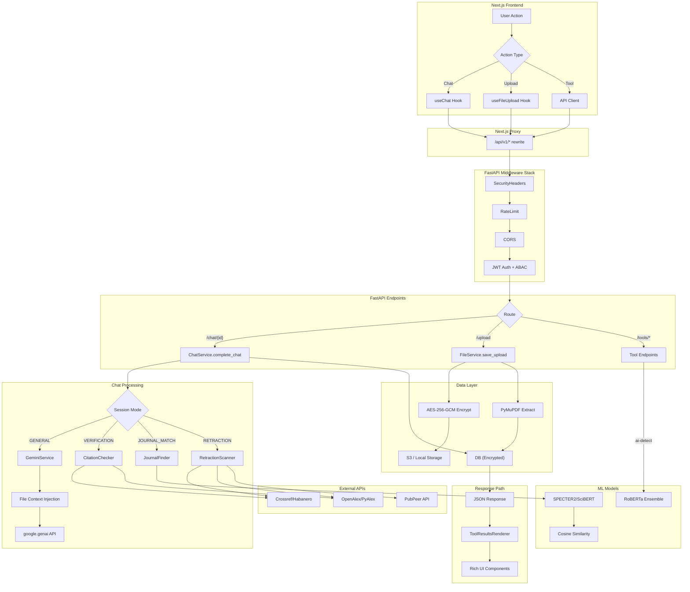

# AIRA (Academic Integrity & Research Assistant) – Tổng Quan Đồ Án

Ngày cập nhật: 2026-02-14

## 1) Mục tiêu & phạm vi

AIRA là nền tảng web dạng hội thoại (chat-based) để hỗ trợ nghiên cứu khoa học:

- Quản lý phiên chat (sessions) và lịch sử hội thoại (messages) theo ngữ cảnh.
- Tích hợp LLM (Google Gemini) cho chế độ hỏi đáp và tóm tắt.
- Tích hợp các tools chuyên sâu (trích dẫn, gợi ý tạp chí, quét retraction, AI writing detect).
- Upload/Download file (PDF) + trích xuất text + lưu trữ dữ liệu nặng trên S3 (hoặc local fallback).
- Bảo mật: JWT auth, phân quyền RBAC + ABAC, mã hóa AES-256-GCM (dữ liệu nghỉ và payload mã hóa tùy chọn).

## 2) Kiến trúc tổng thể

Kiến trúc chính: **Modular Monolith + Layered Architecture**.

- Frontend: Next.js (App Router) + TypeScript + React Query.
- Backend: FastAPI + SQLAlchemy + Pydantic.
- Database: PostgreSQL (production) / SQLite (dev).
- Storage: AWS S3 (primary cho dữ liệu nặng/backup) hoặc Local Storage (dev).
- External APIs: Google Gemini, OpenAlex/Crossref/PubPeer (tools).

Sơ đồ node (hệ thống runtime):

1. Browser (User/Admin)
2. Next.js Frontend (`/frontend`)
3. FastAPI Backend (`/backend`)
4. Database (Users/Sessions/Messages/Files)
5. Object Storage (S3 hoặc local)
6. LLM Provider (Google Gemini)
7. Tool Providers (OpenAlex, Crossref, PubPeer)

## 3) Database & phân quyền (RBAC + ABAC)

### Bảng chính (SQLAlchemy)

- `users`:
  - Lưu tài khoản người dùng và admin.
  - Trường `role` lưu trong DB (`admin` | `researcher`) để phân quyền.
  - File: `backend/app/models/user.py`.

- `chat_sessions`:
  - Lưu danh sách phiên chat (sidebar).
  - Mỗi session thuộc về 1 user (`user_id`).
  - File: `backend/app/models/chat_session.py`.

- `chat_messages`:
  - Lưu lịch sử hội thoại theo session.
  - Có `role` (`user/assistant/system/tool`) và `message_type` để frontend render component.
  - File: `backend/app/models/chat_message.py`.

- `file_attachments`:
  - Metadata file upload gắn với session/message.
  - Dữ liệu nặng nằm ở object storage; DB chỉ lưu metadata (đã mã hóa).
  - File: `backend/app/models/file_attachment.py`.

### Phân quyền

- RBAC:
  - Mapping permission theo role tại `backend/app/core/authorization.py` (`ROLE_PERMISSIONS`).
  - Admin có `admin:manage` và quyền truy cập rộng hơn.

- ABAC (ownership/resource access):
  - `assert_session_access`, `assert_message_access`, `assert_file_access` bảo đảm user chỉ truy cập tài nguyên của mình.
  - File: `backend/app/core/authorization.py`.

## 4) Cryptography & bảo mật dữ liệu

### Master key (AES-256-GCM)

- Master key 32 bytes (base64 urlsafe) được load từ:
  - `ADMIN_MASTER_KEY_B64` trong env, hoặc
  - file `MASTER_KEY_FILE` (mặc định `.aira_master_key`), hoặc
  - auto-generate khi thiếu (tạo file và set permission 0600).
- File: `backend/app/core/crypto.py`.

### Mã hóa dữ liệu nghỉ (At-rest encryption)

- DB encryption:
  - `EncryptedText` và `EncryptedJSON` mã hóa trước khi ghi DB và giải mã khi đọc.
  - Áp dụng cho:
    - `chat_messages.content`, `chat_messages.tool_results`
    - `file_attachments.storage_key`, `storage_url`, `extracted_text`
  - File: `backend/app/core/encrypted_types.py`, `backend/app/models/chat_message.py`, `backend/app/models/file_attachment.py`.

- Storage encryption:
  - File bytes được mã hóa AES-256-GCM trước khi lưu vào S3/local (storage_service).
  - File: `backend/app/services/storage_service.py`.

### Mã hóa dữ liệu khi gửi đi (In-transit)

- TLS/HTTPS: bắt buộc khi deploy production (reverse proxy).
- Application-layer encryption (tùy chọn):
  - `POST /api/v1/chat/completions/encrypted` nhận/gửi payload đã mã hóa AES-256-GCM.
  - AAD ràng buộc theo `current_user.id` để chống chuyển payload giữa user.
  - File: `backend/app/api/v1/endpoints/chat.py`, `backend/app/core/crypto.py`.

### Hardening

- Security headers middleware + CORS allowlist:
  - `backend/app/core/middleware.py`, `backend/app/main.py`, `backend/app/core/config.py`.
- Rate limiting in-memory theo bucket `auth/chat/tools/upload`:
  - `backend/app/core/rate_limit.py`.
- Audit logs (file rotating) cho auth/admin/file actions:
  - `backend/app/core/audit.py`.

## 5) Modules: chức năng, nhiệm vụ, tương tác

Tổng số module chính (khái niệm): **10**.

### Module A – Auth & Users

- Nhiệm vụ:
  - Register/Login/Me
  - Bootstrap admin user
  - Promote role (admin-only)
- Tương tác:
  - API -> DB (`users`) -> JWT token
- Files:
  - `backend/app/api/v1/endpoints/auth.py`
  - `backend/app/core/security.py`
  - `backend/app/services/bootstrap.py`

### Module B – Authorization Gateway (RBAC + ABAC)

- Nhiệm vụ:
  - Bảo vệ toàn bộ endpoint theo permission và ownership
- Files:
  - `backend/app/core/authorization.py`

### Module C – Chat Management (Sessions/Messages)

- Nhiệm vụ:
  - CRUD sessions + list messages
  - Persist messages theo dạng hội thoại
  - Message types để frontend render
- Files:
  - `backend/app/services/chat_service.py`
  - `backend/app/api/v1/endpoints/sessions.py`
  - `backend/app/api/v1/endpoints/chat.py`

### Module D – LLM Integration (Gemini)

- Nhiệm vụ:
  - Sinh câu trả lời Q&A
  - Tóm tắt text (PDF extracted)
  - Context window: gửi kèm N messages gần nhất
- Files:
  - `backend/app/services/llm_service.py`
  - `backend/app/core/config.py` (`GOOGLE_API_KEY`, `GEMINI_MODEL`, `CHAT_CONTEXT_WINDOW`)

### Module E – Scientific Tools

- Nhiệm vụ:
  - Verify citation
  - Journal match
  - Retraction scan
  - AI writing detection
  - Summarize PDF (dựa trên extracted_text)
- Tương tác:
  - API Tools -> Tool engine -> Persist vào `chat_messages` với `message_type` + `tool_results`
- Files:
  - `backend/app/api/v1/endpoints/tools.py`
  - `backend/app/services/tools/*`

### Module F – Storage & File Handling (S3/Local)

- Nhiệm vụ:
  - Upload/Download, list files, stats
  - Encrypt file bytes trước khi lưu
  - PDF text extraction (PyMuPDF)
  - Pre-signed URL cho S3 (khi phù hợp)
- Files:
  - `backend/app/services/storage_service.py`
  - `backend/app/services/file_service.py`
  - `backend/app/api/v1/endpoints/upload.py`

### Module G – Admin Module

- Nhiệm vụ:
  - Overview/users/files/storage health
  - Admin delete any file
  - Audit logging cho hành động nhạy cảm
- Files:
  - `backend/app/api/v1/endpoints/admin.py`
  - `backend/app/schemas/admin.py`

### Module H – Crypto Layer

- Nhiệm vụ:
  - AES-256-GCM primitives
  - Key loading/generation
  - JSON/text encrypt/decrypt helpers
- Files:
  - `backend/app/core/crypto.py`
  - `backend/app/core/encrypted_types.py`

### Module I – Security/Pentest Toolkit

- Nhiệm vụ:
  - Quick audit script non-destructive
  - Reports + remediation matrix
- Files:
  - `backend/security/pentest/quick_audit.py`
  - `backend/security/reports/*`

### Module J – Frontend UI (Bohrium-like)

- Nhiệm vụ:
  - Landing page, login/register
  - Workspace: sidebar sessions + chat + tools/files panel
  - Admin dashboard UI
  - Typed API client + in-memory auth store
- Files:
  - `frontend/app/*`, `frontend/components/*`, `frontend/lib/*`

## 6) Luồng dữ liệu (data flow)

### 6.1 Auth flow

1. User `POST /api/v1/auth/register` -> DB insert `users`.
2. User `POST /api/v1/auth/login` -> JWT -> frontend giữ token in-memory.
3. Frontend gọi `GET /api/v1/auth/me` để lấy profile/role.

### 6.2 Chat flow (General Q&A)

1. Frontend tạo session `POST /api/v1/sessions`.
2. User gửi message `POST /api/v1/chat/{session_id}`.
3. Backend:
  - ABAC check ownership session.
  - Lưu user message vào `chat_messages` (encrypted content).
  - Load context N messages gần nhất.
  - (Optional) kèm snippet extracted_text từ file gần nhất nếu user hỏi “PDF/file/...”.
  - Gọi Gemini (nếu config hợp lệ) hoặc trả fallback text.
  - Lưu assistant message vào `chat_messages`.
4. Frontend poll messages `GET /api/v1/sessions/{session_id}/messages`.

### 6.3 Tool flow

1. Frontend gọi một tool endpoint (verify/journal/retract/ai-detect/summarize).
2. Backend chạy tool, tạo `tool_results` có cấu trúc + `message_type`.
3. Persist vào messages để hiển thị trong hội thoại.

### 6.4 Upload flow

1. Frontend `POST /api/v1/upload` (multipart).
2. Backend:
  - ABAC check session.
  - Validate MIME/size + PDF magic bytes.
  - Encrypt file bytes AES-256-GCM và upload S3/local.
  - Extract PDF text -> lưu encrypted vào DB (`file_attachments.extracted_text`).
  - Log một system message `message_type=file_upload`.
3. Frontend list `GET /api/v1/upload?session_id=...` và download `GET /api/v1/upload/{file_id}` (decrypt server-side).

## 7) API nodes (endpoints)

Tổng số endpoint backend:

- 33 endpoints dưới `/api/v1/*`
- + 1 endpoint `/health`
- Tổng cộng: **34** API nodes

### Auth (4)

- `POST /api/v1/auth/register`
- `POST /api/v1/auth/login`
- `GET /api/v1/auth/me`
- `POST /api/v1/auth/admin/promote`

### Sessions (6)

- `POST /api/v1/sessions`
- `GET /api/v1/sessions`
- `GET /api/v1/sessions/{session_id}`
- `PATCH /api/v1/sessions/{session_id}`
- `DELETE /api/v1/sessions/{session_id}`
- `GET /api/v1/sessions/{session_id}/messages`

### Chat (3)

- `POST /api/v1/chat/{session_id}`
- `POST /api/v1/chat/completions`
- `POST /api/v1/chat/completions/encrypted`

### Tools (6)

- `POST /api/v1/tools/verify-citation`
- `POST /api/v1/tools/journal-match`
- `POST /api/v1/tools/retraction-scan`
- `POST /api/v1/tools/summarize-pdf`
- `POST /api/v1/tools/detect-ai-writing`
- `POST /api/v1/tools/ai-detect` (alias)

### Upload (8)

- `POST /api/v1/upload`
- `GET /api/v1/upload`
- `GET /api/v1/upload/stats/me`
- `GET /api/v1/upload/stats/storage` (admin)
- `GET /api/v1/upload/{file_id}`
- `DELETE /api/v1/upload/{file_id}`
- `POST /api/v1/upload/presigned-upload` (S3 only)
- `GET /api/v1/upload/{file_id}/presigned-download` (S3 only, non-encrypted)

### Admin (6)

- `GET /api/v1/admin/overview`
- `GET /api/v1/admin/users`
- `GET /api/v1/admin/files`
- `DELETE /api/v1/admin/files/{file_id}`
- `GET /api/v1/admin/storage`
- `GET /api/v1/admin/storage/health`

### Health (1)

- `GET /health`

## 8) Backlog phát triển (hướng chuyển tiếp)

- Database migrations: Alembic + schema versioning.
- Rate limiting production-ready: Redis-based limiter, per-user buckets.
- Streaming chat: SSE/WebSocket (frontend + backend).
- Vector DB thật cho journal recommendations (Qdrant/PGVector).
- Key rotation + re-encryption job (KMS/Vault integration).
- Observability: structured logs, tracing, metrics, alerting.

---

## 9) Công nghệ, Mô hình AI, và Thư viện – Phân tích chi tiết

### 9.1 Nền tảng chính (Core Frameworks)

#### Next.js 15 – Frontend

Next.js [1] được chọn làm framework frontend vì hỗ trợ **App Router** (file-based routing với layouts lồng nhau), **Server-Side Rendering** (SSR) và **Static Generation** (SSG) tối ưu SEO, cùng cơ chế **rewrites** cho phép **proxy API** sang backend mà không bị lỗi CORS/mixed-content khi deploy qua ngrok hay HTTPS. Frontend sử dụng **React 18** với `useReducer` + Context pattern cho state management (chat store), **React Query** (`@tanstack/react-query`) cho server-state caching ở trang Admin, và **Tailwind CSS v4** với hệ thống color tokens hỗ trợ dark mode hoàn chỉnh. Mọi API call đi qua Next.js rewrites (`/api/v1/* → http://127.0.0.1:8000/api/v1/*`), giúp browser chỉ cần kết nối tới một origin duy nhất.

#### FastAPI – Backend

FastAPI [2] được chọn vì native async support (mặc dù các endpoint hiện chạy sync trên thread pool), auto-generated OpenAPI documentation (Swagger/ReDoc), và hệ sinh thái Pydantic v2 cho request/response validation nghiêm ngặt tại biên. Backend sử dụng **SQLAlchemy 2.0** ORM với async-compatible engine, **Pydantic Settings** (`pydantic-settings`) cho configuration management từ `.env`, và mô hình middleware stack: `SecurityHeadersMiddleware` → `RateLimitMiddleware` → `CORSMiddleware` → Router. Lifespan events quản lý startup (bootstrap admin, load ML models) và shutdown (cleanup httpx clients).

### 9.2 Mô hình AI từ Hugging Face – Phân tích lựa chọn

#### SPECTER2 (Journal Recommendation)

**SPECTER2** [3] (Scientific Paper Embeddings using Citation-informed Transformers, version 2) là mô hình embedding được huấn luyện trên hàng triệu bài báo khoa học bởi Allen Institute for AI. Hệ thống sử dụng phiên bản `allenai/specter2_base` [4] — phiên bản base không yêu cầu PEFT adapters, tránh lỗi configuration khi load.

**Lý do chọn thay vì LLM tổng quát:** SPECTER2 được huấn luyện trên đồ thị trích dẫn (citation graph) — hai bài báo trích dẫn lẫn nhau sẽ có embedding vectors gần nhau trong không gian vector. Điều này tạo ra biểu diễn ngữ nghĩa (semantic representation) chính xác hơn cho văn bản khoa học so với mô hình như BERT hay GPT vốn được huấn luyện trên văn bản tổng quát. Khi so sánh abstract của người dùng với profile tạp chí, SPECTER2 nắm bắt được mối quan hệ chủ đề học thuật mà mô hình tổng quát bỏ lỡ.

#### SciBERT (Fallback cho Journal Recommendation)

**SciBERT** [5] (`allenai/scibert_scivocab_uncased`) là mô hình BERT được pre-train trên 1.14 triệu bài báo từ Semantic Scholar, sử dụng vocabulary riêng tối ưu cho thuật ngữ khoa học (scivocab). SciBERT đóng vai trò fallback khi SPECTER2 không tải được — vẫn cung cấp biểu diễn vector chất lượng cho văn bản khoa học nhờ vocabulary chuyên ngành.

#### RoBERTa Ensemble (AI Writing Detection)

Hệ thống sử dụng mô hình **`roberta-base-openai-detector`** [6] — RoBERTa fine-tuned bởi OpenAI để phát hiện văn bản được tạo bởi GPT-2. Mô hình nhận input tokenized (tối đa 512 tokens), output softmax probabilities với index `[1]` là xác suất văn bản do AI tạo.

**Lý do dùng ensemble thay vì chỉ ML:** Mô hình RoBERTa được huấn luyện trên GPT-2 output, do đó có thể đánh giá thấp văn bản từ các mô hình hiện đại hơn (GPT-4, Gemini). Hệ thống kết hợp **70% ML score + 30% rule-based score** (ensemble) với 7 đặc trưng ngôn ngữ (sentence uniformity, vocabulary diversity, AI-typical patterns, v.v.) để bổ sung cho điểm yếu của mô hình ML.

#### all-MiniLM-L6-v2 (Ultimate Fallback)

**`sentence-transformers/all-MiniLM-L6-v2`** [7] là mô hình nhẹ (22M parameters, 80MB) từ sentence-transformers, được huấn luyện trên 1B+ sentence pairs. Đây là fallback cuối cùng khi cả SPECTER2 và SciBERT đều không tải được — cung cấp embedding chất lượng tốt cho general-purpose text mặc dù không chuyên về khoa học.

### 9.3 External APIs – Citation Verification Pipeline

#### OpenAlex

**OpenAlex** [8] là cơ sở dữ liệu học thuật mở (thay thế Microsoft Academic Graph), chứa hơn 250 triệu bài báo với metadata phong phú (authors, institutions, concepts, citations). Hệ thống sử dụng OpenAlex qua thư viện **PyAlex** [9] SDK cho tìm kiếm tác giả/năm/title, và fallback sang HTTP trực tiếp qua **httpx** nếu SDK gặp lỗi. OpenAlex cũng cung cấp trường `is_retracted` cho retraction detection.

#### Crossref via Habanero

**Crossref** [10] là registrar DOI lớn nhất thế giới, chứa metadata chính xác nhất cho bài báo có DOI. Hệ thống truy cập Crossref qua thư viện **Habanero** [11] (Python SDK cho Crossref API). Vai trò chính: (1) Xác minh DOI với confidence 1.0, (2) Truy vấn trường **`update-to`** — trường đặc biệt chứa thông tin về retraction, correction, expression-of-concern mà OpenAlex không cung cấp.

#### PubPeer

**PubPeer** [12] là nền tảng post-publication peer review, nơi cộng đồng khoa học có thể báo cáo vấn đề về bài báo đã xuất bản. Hệ thống truy vấn PubPeer API để lấy số lượng bình luận và quét keyword concerns (`fraud`, `fabrication`, `manipulation`, `plagiarism`, v.v.) trong nội dung bình luận. PubPeer đặc biệt hữu ích để phát hiện vấn đề chưa được retract chính thức.

### 9.4 Thư viện hỗ trợ

| Thư viện | Phiên bản | Vai trò trong hệ thống | Tham khảo |
|----------|-----------|------------------------|-----------|
| `sentence-transformers` | 5.2.3 | Framework loading SPECTER2/SciBERT/MiniLM, sinh embedding vectors | [13] |
| `transformers` | 5.2.0 | Loading RoBERTa pipeline, tokenization, inference | [14] |
| `torch` | 2.10.0+cpu | Backend computation cho transformer models | [15] |
| `scikit-learn` | 1.8.0 | TF-IDF vectorization (fallback khi không có ML) | [16] |
| `PyMuPDF (fitz)` | — | Trích xuất text từ PDF (page-by-page text blocks) | [17] |
| `PyCryptodome` | — | AES-256-GCM encryption/decryption primitives | [18] |
| `python-jose` | — | JWT token signing/verification (HS256) | [19] |
| `bcrypt` | — | Password hashing (bcrypt algorithm) | [20] |
| `google-genai` | ≥1.0.0 | Google Gemini LLM SDK (thế hệ mới, thay thế google-generativeai) | [21] |
| `httpx` | — | Async-capable HTTP client với retry transport | [22] |
| `boto3` | — | AWS S3 SDK cho object storage | [23] |

### 9.5 Tài liệu tham khảo

- [1] Next.js Documentation — https://nextjs.org/docs
- [2] FastAPI Documentation — https://fastapi.tiangolo.com/
- [3] Singh, A. et al. "SciRepEval: A Multi-Format Benchmark for Scientific Document Representations." arXiv:2211.13308, 2022.
- [4] Allen AI SPECTER2 Base — https://huggingface.co/allenai/specter2_base
- [5] Beltagy, I., Lo, K., & Cohan, A. "SciBERT: A Pretrained Language Model for Scientific Text." EMNLP 2019. https://huggingface.co/allenai/scibert_scivocab_uncased
- [6] OpenAI GPT-2 Output Detector — https://huggingface.co/openai-community/roberta-base-openai-detector
- [7] Reimers, N. & Gurevych, I. "Sentence-BERT: Sentence Embeddings using Siamese BERT-Networks." EMNLP 2019. https://huggingface.co/sentence-transformers/all-MiniLM-L6-v2
- [8] Priem, J. et al. "OpenAlex: A fully-open index of scholarly works, authors, venues, institutions, and concepts." arXiv:2205.01833, 2022. https://openalex.org/
- [9] PyAlex — Python SDK for OpenAlex. https://github.com/J535D165/pyalex
- [10] Crossref REST API — https://api.crossref.org/swagger-ui/index.html
- [11] Habanero — Python SDK for Crossref. https://github.com/sckott/habanero
- [12] PubPeer — Post-Publication Peer Review. https://pubpeer.com/
- [13] Sentence-Transformers Documentation — https://www.sbert.net/
- [14] Hugging Face Transformers — https://huggingface.co/docs/transformers
- [15] PyTorch — https://pytorch.org/
- [16] Scikit-learn Documentation — https://scikit-learn.org/
- [17] PyMuPDF Documentation — https://pymupdf.readthedocs.io/
- [18] PyCryptodome Documentation — https://pycryptodome.readthedocs.io/
- [19] python-jose — https://github.com/mpdavis/python-jose
- [20] bcrypt — https://github.com/pyca/bcrypt
- [21] Google GenAI SDK — https://github.com/googleapis/python-genai
- [22] HTTPX Documentation — https://www.python-httpx.org/
- [23] Boto3 Documentation — https://boto3.amazonaws.com/v1/documentation/api/latest/

---

## 10) Kiến trúc luồng dữ liệu chi tiết (Data Flow Architecture)

### 10.1 Luồng Upload & Xử lý File PDF

Khi người dùng upload file PDF từ giao diện Next.js, dữ liệu đi qua pipeline sau:

1. **Frontend (Next.js):** Hook `useFileUpload` gọi `api.uploadFile(token, sessionId, file)` → gửi `multipart/form-data` qua `POST /api/v1/upload`.
2. **Next.js Proxy:** Request được rewrite qua `next.config.mjs` sang `http://127.0.0.1:8000/api/v1/upload` — browser không biết backend tồn tại.
3. **FastAPI Middleware Stack:** Request đi qua `SecurityHeadersMiddleware` (thêm CSP/HSTS headers) → `RateLimitMiddleware` (check bucket `upload`, max 20 req/phút) → `CORSMiddleware`.
4. **Auth + ABAC:** `get_current_user()` decode JWT → `assert_session_access()` xác minh ownership.
5. **Validation:** `FileService.save_upload()` kiểm tra: (a) MIME type hợp lệ, (b) kích thước ≤ 20MB, (c) PDF magic bytes (`%PDF-`) nếu MIME là `application/pdf`.
6. **Sanitize filename:** Regex `/[^A-Za-z0-9._-]/` → `"_"`, giới hạn 200 ký tự.
7. **Encryption + Storage:** `StorageService.upload(data, key, encrypt=True)` → AES-256-GCM mã hóa bytes → upload lên S3 (hoặc local filesystem).
8. **PDF Text Extraction:** `FileService.extract_pdf_text()` dùng PyMuPDF — `fitz.open(stream=BytesIO(payload))` → lặp qua từng page → `page.get_text("text")` → join thành string.
9. **Database Persist:** Tạo record `FileAttachment` với: `storage_encrypted=True`, `encryption_alg="AES-256-GCM"`, `extracted_text` (encrypted via `EncryptedText` SQLAlchemy type). Log system message `message_type=file_upload` vào `chat_messages`.
10. **Response:** Trả JSON metadata (attachment_id, file_name, mime_type, size) → Frontend render `FileAttachmentCard` component hiện icon PDF, tên file, badge mã hóa.

### 10.2 Luồng Xác minh Trích dẫn (Citation Verification)

Khi người dùng gửi trích dẫn cần xác minh, backend gọi đồng thời nhiều API nguồn:

1. **Frontend:** Gửi `POST /api/v1/tools/verify-citation` với body `{ "text": "Smith et al., 2020..." }`.
2. **Citation Extraction:** `CitationChecker.extract_citations(text)` chạy **6 regex patterns** theo thứ tự ưu tiên: DOI → APA reference → APA inline → IEEE → Vancouver → Simple. Mỗi match tạo một `citation` dict.
3. **Routing theo loại trích dẫn:**
   - **DOI citations** → `_verify_doi_crossref(doi)` → Habanero SDK gọi `Crossref.works(ids=doi)`. Nếu SDK fail → fallback httpx `GET https://api.crossref.org/works/{doi}` với timeout 10s, retry 2 lần.
   - **Non-DOI citations** → `_verify_openalex(citation)` → PyAlex SDK `Works().search(query).get(per_page=3)`. Nếu SDK fail → fallback httpx `GET https://api.openalex.org/works?search=...`.
4. **Fuzzy Matching:** Cho kết quả từ OpenAlex, hệ thống tính `match_confidence` bằng trung bình: (a) **Year match** — exact=1.0, ±1=0.5, else=0.0; (b) **Author match** — `difflib.SequenceMatcher.ratio()` giữa các cặp tên tác giả. Ngưỡng: ≥0.7 → VALID, ≥0.4 → PARTIAL_MATCH, <0.4 → HALLUCINATED.
5. **Aggregation:** Tập hợp tất cả `CitationCheckResult` — mỗi trích dẫn có status, DOI, evidence, confidence score.
6. **Persist & Response:** `ChatService.persist_tool_interaction()` lưu kết quả vào `chat_messages` với `message_type="citation_report"`, `tool_results` chứa JSON cấu trúc.
7. **Frontend Render:** `ToolResultsRenderer` dispatch tới `CitationReportCard` → hiển thị từng trích dẫn với status icon (✓ xanh / ✗ đỏ / ⚠ vàng), DOI link, confidence badge màu.

### 10.3 Luồng Gợi ý Tạp chí (Journal Recommendation)

1. **Input:** Người dùng gửi abstract → `POST /api/v1/tools/journal-match`.
2. **Domain Detection:** `JournalFinder._detect_domains(text)` quét text qua 10 nhóm từ khóa lĩnh vực (CS, ML, NLP, Medicine, v.v.) — lĩnh vực match nếu ≥2 keywords xuất hiện.
3. **Embedding Generation:**
   - **ML path** (SPECTER2/SciBERT): `SentenceTransformer.encode(query)` → vector 768-dim. So sánh với pre-computed journal embeddings (tính sẵn lúc load model) bằng cosine similarity → normalize `(sim+1)/2` → score ∈ [0,1].
   - **TF-IDF fallback**: Tokenize bằng regex `/[a-zA-Z]{3,}/`, build Counter vectors, tính cosine similarity thủ công.
4. **Score Adjustment:** Cộng domain bonus (+0.05 mỗi domain trùng), nhân ×1.1 cho tạp chí Open Access.
5. **Output:** Top-k tạp chí (mặc định 5) với: tên, IF, h-index, publisher, acceptance rate, review time, URL → Frontend render `JournalListCard`.

### 10.4 Luồng Chat Tổng quát (General Q&A)

1. **Frontend:** `sendMessage(token, text)` → auto-create session nếu chưa có → `POST /api/v1/chat/{session_id}`.
2. **Mode Routing** (`ChatService.complete_chat()`):
   - `VERIFICATION` → `citation_checker.verify(text)` → persist `message_type=citation_report`
   - `JOURNAL_MATCH` → `journal_finder.recommend(text)` → persist `message_type=journal_list`
   - `RETRACTION_CHECK` → `retraction_scanner.scan(text)` → persist `message_type=retraction_report`
   - `GENERAL` (default) → Gemini LLM
3. **File Context Injection** (cho mode GENERAL): Regex detect từ khóa liên quan file (`pdf|document|paper|summarize|...`) → nếu match, lấy `extracted_text` từ file gần nhất của session (tối đa 4000 ký tự) → append vào message gửi Gemini.
4. **LLM Call:** `GeminiService._build_prompt()` serialize 8 messages gần nhất thành format `[ROLE] content` → `google.genai.Client.models.generate_content(model, contents, config={system_instruction})`.
5. **Persist:** Lưu user message + assistant message vào DB (encrypted) → Frontend poll messages và render.

### 10.5 Sơ đồ luồng dữ liệu (Mermaid)

---

## 11) Kiến thức Lý thuyết Cốt lõi & Thuật toán

### 11.1 Tìm kiếm Ngữ nghĩa & Vector Embeddings

#### Lý thuyết: Biểu diễn văn bản dạng Vector

Trong xử lý ngôn ngữ tự nhiên, mỗi đoạn văn bản có thể được chuyển đổi thành một **dense vector** (vector dày đặc) trong không gian nhiều chiều (thường 768 chiều cho mô hình BERT-based). Quá trình này gọi là **encoding** hoặc **embedding**:

$$\text{embed}: \text{Text} \rightarrow \mathbb{R}^d \quad (d = 768)$$

SPECTER2 thực hiện encoding bằng kiến trúc Transformer (cụ thể là BERT encoder), với điểm đặc biệt: mô hình được huấn luyện trên **triplet loss** sử dụng đồ thị trích dẫn — bài báo A trích dẫn bài báo B được coi là "positive pair", bài báo ngẫu nhiên C là "negative". Kết quả: hai bài báo liên quan về chủ đề sẽ có vector gần nhau.

#### Cosine Similarity — Đo khoảng cách ngữ nghĩa

Sau khi có vector embedding cho abstract người dùng ($\vec{q}$) và mỗi tạp chí ($\vec{j_i}$), hệ thống tính **Cosine Similarity**:

$$\text{sim}(\vec{q}, \vec{j_i}) = \frac{\vec{q} \cdot \vec{j_i}}{|\vec{q}| \cdot |\vec{j_i}|} = \frac{\sum_{k=1}^{d} q_k \cdot j_{i,k}}{\sqrt{\sum_{k=1}^{d} q_k^2} \cdot \sqrt{\sum_{k=1}^{d} j_{i,k}^2}}$$

Giá trị nằm trong khoảng $[-1, 1]$, trong đó:
- $1$ = hoàn toàn cùng hướng (cùng chủ đề)
- $0$ = không liên quan
- $-1$ = ngược hướng

Hệ thống normalize về $[0, 1]$ bằng phép biến đổi:

$$\text{score} = \frac{\text{sim} + 1}{2}$$

**Tại sao dùng Cosine thay vì Euclidean Distance?** Cosine similarity đo **hướng** (direction) của vector, không phải **độ lớn** (magnitude). Hai bài báo cùng chủ đề nhưng khác độ dài sẽ có vector cùng hướng nhưng khác magnitude — Cosine vẫn cho similarity cao, trong khi Euclidean distance sẽ cho khoảng cách lớn (sai lệch).

#### TF-IDF Fallback

Khi không có ML model, hệ thống dùng **TF-IDF** (Term Frequency – Inverse Document Frequency) thủ công:
- Tokenize bằng regex `/[a-zA-Z]{3,}/` → loại bỏ stop words ngầm (từ ngắn <3 ký tự)
- Build `Counter` vector cho mỗi document
- Tính cosine similarity trên các bag-of-words vectors

TF-IDF đơn giản hơn nhiều — chỉ bắt từ khóa trùng, không nắm được quan hệ ngữ nghĩa ("deep learning" vs "neural networks" sẽ không match dù cùng chủ đề). Đây là lý do hệ thống ưu tiên SPECTER2.

### 11.2 Ensemble Learning cho Phân loại AI Text

#### Kiến trúc Ensemble: ML + Rule-Based

Hệ thống phát hiện văn bản AI sử dụng phương pháp **weighted ensemble** kết hợp hai thành phần:

$$\text{final\_score} = \alpha \cdot \text{ML\_score} + (1 - \alpha) \cdot \text{rule\_score} \quad (\alpha = 0.7)$$

#### Thành phần ML: RoBERTa Classifier

**RoBERTa** (Robustly Optimized BERT Approach) [24] là phiên bản tối ưu của BERT, được OpenAI fine-tune trên cặp (human text, GPT-2 generated text) để phân loại nhị phân.

**Pipeline xử lý:**
1. **Tokenization:** Văn bản input được tokenize bằng RoBERTa tokenizer, cắt tại 512 tokens (giới hạn kiến trúc Transformer).
2. **Inference:** Forward pass qua 12 lớp Transformer encoder → logits 2 chiều `[p_human, p_ai]`.
3. **Softmax:** Chuyển logits thành xác suất:

$$P(\text{AI}) = \frac{e^{z_{\text{AI}}}}{e^{z_{\text{human}}} + e^{z_{\text{AI}}}}$$

4. **Chunking cho văn bản dài:** Văn bản >512 tokens được chia thành chunks 500 từ (overlap tối thiểu 50 từ), mỗi chunk được phân tích độc lập, kết quả lấy **trung bình**.

#### Thành phần Rule-Based: 7 Đặc trưng Ngôn ngữ

| Đặc trưng | Trọng số | Ý nghĩa |
|-----------|----------|---------|
| AI pattern density | 0.25 | Mật độ cụm từ điển hình AI ("delve into", "plethora of", "paradigm shift") — 30 patterns |
| Sentence length uniformity | 0.20 | Hệ số biến thiên (CV) độ dài câu — AI tạo câu đều nhau, người viết đa dạng hơn |
| Filler phrase density | 0.15 | Mật độ cụm từ đệm ("it is important to note", "in this regard") — 20 patterns |
| Vocabulary diversity (TTR inverse) | 0.15 | Type-Token Ratio nghịch đảo — AI có xu hướng lặp từ vựng hạn chế |
| Transition word density | 0.10 | Mật độ từ chuyển tiếp ("Furthermore", "Moreover") — 26 patterns |
| Sentence repetition | 0.10 | Tỷ lệ câu bắt đầu giống nhau (2-word starters trùng lặp) |
| Hapax ratio inverse | 0.05 | Nghịch đảo tỷ lệ từ xuất hiện đúng 1 lần (hapax legomena) |

**Sentence Length Uniformity** sử dụng **Coefficient of Variation (CV)**:

$$CV = \frac{\sigma}{\mu} = \frac{\sqrt{\frac{1}{n}\sum_{i=1}^{n}(l_i - \bar{l})^2}}{\bar{l}}$$

Trong đó $l_i$ là độ dài câu thứ $i$. CV thấp (<0.25) → câu đều nhau (đặc trưng AI) → score cao (0.9). CV cao (>0.55) → câu đa dạng (đặc trưng người) → score thấp (0.1).

#### Bảng phân loại kết quả

| Final Score | Verdict | Ý nghĩa |
|-------------|---------|---------|
| < 0.25 | LIKELY_HUMAN | Rất có thể do người viết |
| 0.25 – 0.40 | POSSIBLY_HUMAN | Có thể do người viết |
| 0.40 – 0.60 | UNCERTAIN | Không chắc chắn |
| 0.60 – 0.75 | POSSIBLY_AI | Có thể do AI tạo |
| ≥ 0.75 | LIKELY_AI | Rất có thể do AI tạo |

**Confidence Level** phụ thuộc vào lượng text: `LOW` (<100 tokens), `MEDIUM` (100–300 tokens hoặc ít flags), `HIGH` (≥300 tokens VÀ (≥3 flags HOẶC score>0.7)).

### 11.3 Phân tích Rủi ro Retraction — Mô hình Đa nguồn

Hệ thống đánh giá rủi ro retraction bằng mô hình **multi-source risk aggregation** — tổng hợp tín hiệu từ 3 nguồn độc lập:

| Nguồn | Tín hiệu thu thập | Vai trò |
|-------|-------------------|---------|
| Crossref | Trường `update-to` (retraction/correction/expression-of-concern) | Source of truth cho status chính thức |
| OpenAlex | Flag `is_retracted` | Cross-validation, metadata bổ sung |
| PubPeer | Số lượng và nội dung bình luận (keyword scan: fraud, fabrication, v.v.) | Early warning cho vấn đề chưa chính thức |

**Risk Level Classification:**

$$\text{Risk} = \begin{cases} \text{CRITICAL} & \text{nếu Crossref retraction/withdrawal HOẶC OpenAlex is\_retracted} \\ \text{HIGH} & \text{nếu Expression-of-Concern HOẶC PubPeer ≥ 5 comments} \\ \text{MEDIUM} & \text{nếu PubPeer ≥ 2 comments} \\ \text{LOW} & \text{nếu PubPeer ≥ 1 comment} \\ \text{NONE} & \text{không có tín hiệu rủi ro} \end{cases}$$

Mô hình này kết hợp **formal signals** (Crossref — thường có độ trễ vài tháng đến vài năm sau khi vấn đề được phát hiện) với **informal signals** (PubPeer — phản hồi nhanh từ cộng đồng), tạo hệ thống cảnh báo sớm toàn diện hơn so với chỉ kiểm tra trạng thái retraction trên một nguồn duy nhất.

### 11.4 Tham khảo bổ sung

- [24] Liu, Y. et al. "RoBERTa: A Robustly Optimized BERT Pretraining Approach." arXiv:1907.11692, 2019.
- [25] Devlin, J. et al. "BERT: Pre-training of Deep Bidirectional Transformers for Language Understanding." NAACL 2019.
- [26] Vaswani, A. et al. "Attention Is All You Need." NeurIPS 2017. (Transformer architecture)

